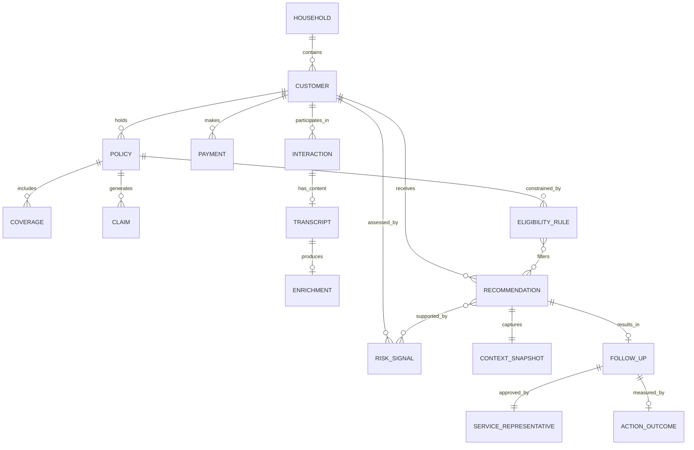

## Plan: Write `docs/ontology.md` with gap analysis, corrections, and decision log

**Single file:** `docs/ontology.md`

---

### Gaps Identified (corrections applied in the document)

| # | Gap | Impact | Resolution |
|---|-----|--------|------------|
| G1 | **No temporal dimension on RiskSignal.** Signals are described as "recalculated per session" but the system needs to explain *trend* (sentiment getting worse over time). A point-in-time-only signal cannot express trajectory. | Explainability weakened — "negative trend" requires comparing current to prior state. | Add `signal_direction` (improving/stable/worsening) computed by comparing current window to prior window. Signals remain ephemeral but carry trend metadata. |
| G2 | **Interaction lacks channel and direction.** Without inbound/outbound and channel type, the system cannot filter for "inbound call" (the MVP trigger) or weight signals by recency and modality. | Cannot implement the MVP scenario trigger correctly. | Add `channel` (phone, email, chat) and `direction` (inbound, outbound, internal_note) to Interaction. |
| G3 | **No concept linking Policy to renewal eligibility rules.** The NBA engine needs to know whether a loyalty adjustment is *eligible* — not all policies permit discretionary renewal terms. | Recommendation may suggest ineligible actions. | Add `EligibilityRule` as a lightweight concept: a set of business constraints per policy/product that filter candidate actions. Not a full rules engine — a boolean gate per action type. |
| G4 | **Enrichment has no failure/retry state.** If Cortex returns an error, the ontology has no way to distinguish "not yet enriched" from "enrichment attempted and failed" from "enrichment not applicable." | Fallback logic cannot correctly determine whether to wait, retry, or proceed without. | Add `enrichment_status` (pending, completed, failed, not_applicable) to the Enrichment concept. |
| G5 | **ActionOutcome has no attribution model.** Recording "renewed" after a Follow-Up doesn't establish causation. Without a stated attribution approach, outcome data is misleading. | Feedback loop produces false confidence in action effectiveness. | Add `attribution_method` (direct, correlated, unknown) and `confounders_noted` (free text or flags). Make explicit that MVP attribution is observational, not causal. |
| G6 | **No concept for the 360 assembly itself.** The "Customer 360 view" is referenced everywhere but isn't a named ontology concept. It's the composite artifact the rep actually sees — and it has a timestamp, completeness state, and staleness. | Cannot express "the view the rep saw at decision time" in the audit trail. | Add **ContextSnapshot** — the frozen state of the 360 assembly at the moment a Recommendation is generated. Stored with the Recommendation for audit replay. |
| G7 | **Household relationship is underspecified.** Is it address-based? Explicit linkage? Can a customer belong to multiple households? | Multi-policy signal may be incorrect if household logic is ambiguous. | Define: household membership is explicit (seeded in synthetic data). A customer belongs to exactly one household. Household is determined by shared address in MVP; production would use carrier's household matching logic. |
| G8 | **Privacy: no data retention or access-tier distinction.** Transcripts (PII-heavy) and Enrichments (derived, lower PII) have different sensitivity levels but no articulated access boundary. | RBAC design lacks guidance on what the ServiceRepresentative sees vs. what the Auditor sees. | Define access tiers: Tier 1 (Enrichment summaries, RiskSignals) — visible to ServiceRep. Tier 2 (full Transcript text) — visible to ServiceRep only during active interaction. Tier 3 (decision audit with evidence snapshots) — visible to Auditor. |

---

### Major Design Decisions (documented in the file)

| # | Decision | Alternatives Considered | Rationale |
|---|----------|------------------------|-----------|
| D1 | **RiskSignals are ephemeral (computed per lookup), not persisted as historical time-series.** | Persist all historical signals for trend analysis. | MVP doesn't need historical signal storage — trend is computed by comparing current-window signals to prior-window within a single computation pass. Avoids storage complexity and staleness. |
| D2 | **Recommendation is immutable. Modifications create a Follow-Up record, not an edited Recommendation.** | Allow recommendation editing. | Audit integrity requires the original suggestion to remain unchanged. The Follow-Up captures what the human actually decided, preserving the gap for analysis. |
| D3 | **"Agent" excluded; "ServiceRepresentative" used instead.** | Include Agent as a separate entity for field sales agents. | MVP has one persona. "Agent" is ambiguous in a system that also uses AI agents. Field agent support is future scope. |
| D4 | **Complaint absorbed into Interaction via disposition attribute, not modeled separately.** | Separate Complaint entity with its own lifecycle. | A complaint is an interaction with a specific disposition. Separate modeling adds a classification burden without MVP value. Topic extraction from transcripts surfaces complaint *themes* without requiring structured complaint records. |
| D5 | **Consent scoped to recording acknowledgment and rep approval only.** | Full consent management (channel preferences, opt-out, TCPA). | MVP has no outbound automated actions. Consent complexity is deferred until outbound capabilities exist. |
| D6 | **ContextSnapshot captured with each Recommendation for audit replay.** | Reference live 360 view at audit time. | The 360 view changes over time. Audit requires knowing exactly what the rep saw when they made their decision, not what the data looks like later. |
| D7 | **EligibilityRule is a boolean gate, not a full rules engine.** | Build a configurable rules engine with complex conditions. | MVP needs only to filter obviously ineligible actions (e.g., "loyalty adjustment not available on this product"). Complex eligibility is future scope. |
| D8 | **Attribution is observational with explicit uncertainty.** | Claim causal attribution of outcomes to actions. | No control group exists in a prototype. Stating "this action caused renewal" is unsupported. The ontology forces explicit attribution_method and confounders. |

---

### Document Structure (sections in `docs/ontology.md`)

1. Purpose and scope
2. Business concepts — definition table (14 concepts: Customer, Household, Policy, Coverage, Claim, Payment, Interaction, Transcript, Enrichment, RiskSignal, Recommendation, ContextSnapshot, Follow-Up, ActionOutcome, ServiceRepresentative, EligibilityRule)
3. Challenged and excluded concepts (Agent, Complaint-as-entity, full Consent management)
4. Relationships and cardinalities (textual + Mermaid diagram)
5. Business rules (7 rules including immutability, fallback, eligibility filtering)
6. Customer lifecycle (prospect → active → renewal window → outcome)
7. Interaction lifecycle (initiated → completed → enriched/unenriched)
8. Recommendation and action lifecycle (context → signals → recommendation → approval → follow-up → outcome)
9. Consent scope (narrow MVP definition)
10. Evidence model (signal → source reference → confidence → completeness)
11. Outcome and feedback loop (with attribution model)
12. Access tiers and privacy boundaries
13. Gap analysis (the table above, preserved as a design record)
14. Decision log (the table above, preserved for future maintainers)
15. Multi-perspective review (servicing, retention, underwriting, privacy, explainability, outcome measurement)
16. Mermaid ER diagram (updated to include ContextSnapshot and EligibilityRule)

---

### Updated Mermaid Diagram

---

### Verification
- Trace golden demo: Customer (Maria) → Household → Policies (auto, home) → Interactions (2 negative) → Transcripts → Enrichments (sentiment) → RiskSignals (renewal_proximity + sentiment_trend) → ContextSnapshot → Recommendation → Follow-Up (rep approves) → ActionOutcome (renewal observed later)
- Every mandatory MVP item in solution-design.md has at least one supporting ontology concept
- EligibilityRule ensures the "loyalty adjustment" action in the golden demo is gated by policy eligibility
- ContextSnapshot ensures audit can replay exactly what the rep saw
- Attribution model prevents false causal claims in outcome analysis

### Critical File
- `docs/ontology.md` — sole deliverable