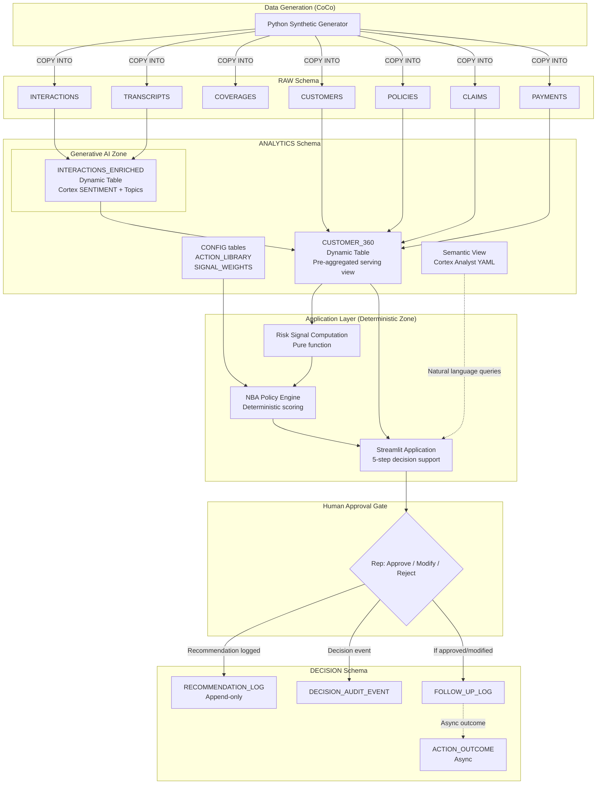

# Architecture — Customer 360 and Next Best Action

## Design Principles

1. **Snowflake-native.** Every component runs within Snowflake — no external compute, no external storage, no external orchestration.
2. **Deterministic rules separate from generative AI.** The NBA scoring engine is a pure function of structured inputs. AI (Cortex) contributes indicators only — never decisions.
3. **Human-in-the-loop.** No action is executed without explicit representative approval. The system recommends; humans decide.
4. **Buildable in six days.** Complexity is ruthlessly scoped. Enterprise patterns are documented for production but not implemented unless they serve the demo.
5. **Graceful degradation.** If AI enrichment fails, the system still works with structured data only.

---

## 1. Component Responsibilities

| # | Component | Responsibility | Snowflake Service | Schema |
|---|-----------|---------------|-------------------|--------|
| 1 | **Synthetic Data Generator** | Produce realistic insurance data covering golden demo scenarios | Python script (local via CoCo) → staged CSVs → COPY INTO | RAW |
| 2 | **Raw Ingestion** | Land source data as-is with audit columns | COPY INTO from internal stage | RAW |
| 3 | **Transcript Enrichment** | Apply Cortex SENTIMENT + topic extraction to interaction text | Dynamic Table calling Cortex functions | ANALYTICS |
| 4 | **Customer 360 Assembly** | Pre-aggregate all structured + enriched data into a query-ready view per customer | Dynamic Table joining RAW + enrichment | ANALYTICS |
| 5 | **Semantic View** | Enable natural-language querying over the 360 model | Cortex Analyst YAML semantic model | ANALYTICS |
| 6 | **Risk Signal Computation** | Compute named, weighted, directional signals per customer | Python function in Streamlit (deterministic) | Application layer |
| 7 | **NBA Policy Engine** | Score candidate actions, filter by eligibility, rank by safety | Python function in Streamlit (deterministic) | Application layer |
| 8 | **Streamlit Application** | Decision-support UX: search → context → risk → recommendation → approval | Streamlit-in-Snowflake | — |
| 9 | **Human Approval Gate** | Accept / Modify / Reject — no action without consent | Streamlit UI + write to DECISION | DECISION |
| 10 | **Decision Logging** | Immutable record of every recommendation, decision, and outcome | Standard tables (append-only) | DECISION |
| 11 | **Monitoring & Audit** | Pipeline health, DQ assertions, decision traceability | Task history + DQ queries + TIME TRAVEL | Cross-schema |
| 12 | **RBAC & Masking** | Role-based access, PII masking for auditor, schema-level grants | Roles + dynamic data masking | Cross-schema |
| 13 | **Testing** | Pipeline correctness, NBA determinism, fallback behavior, RBAC boundaries | SQL assertions + Python unit tests | — |

---

## 2. End-to-End Data Flow

```
┌─────────────────────────────────────────────────────────────────────────────────┐
│                           DATA FLOW                                              │
├─────────────────────────────────────────────────────────────────────────────────┤
│                                                                                 │
│  ┌──────────────┐                                                               │
│  │ Synthetic    │  Python script → CSV → internal stage → COPY INTO             │
│  │ Generator    │                                                               │
│  └──────┬───────┘                                                               │
│         │                                                                       │
│         ▼                                                                       │
│  ┌──────────────────────────────────────────────┐                               │
│  │  RAW SCHEMA                                  │  ← Tier 4: DATA_ENGINEER only │
│  │  • CUSTOMERS        • INTERACTIONS           │                               │
│  │  • POLICIES         • TRANSCRIPTS            │                               │
│  │  • COVERAGES        • SERVICE_REPS           │                               │
│  │  • CLAIMS           • (loaded once,          │                               │
│  │  • PAYMENTS           immutable)             │                               │
│  └──────────────────────┬───────────────────────┘                               │
│                         │                                                       │
│         ┌───────────────┼───────────────────┐                                   │
│         ▼                                   ▼                                   │
│  ┌─────────────────┐              ┌──────────────────────┐                      │
│  │ Dynamic Table:  │              │ Dynamic Table:       │                      │
│  │ INTERACTIONS    │              │ CUSTOMER_360         │◄─── joins all RAW    │
│  │ _ENRICHED       │──────────────│                      │     + enrichment     │
│  │                 │  enrichment  │ Pre-aggregated:      │                      │
│  │ Cortex AI:      │  feeds into  │ • Identity           │                      │
│  │ • SENTIMENT()   │  360 view    │ • Policy summary     │                      │
│  │ • COMPLETE()    │              │ • Payment status     │                      │
│  │   (topics)     │              │ • Claims summary     │                      │
│  │                 │              │ • Interaction + sent. │                      │
│  └─────────────────┘              │ • Sentiment trend    │                      │
│   ANALYTICS schema                │ • Data completeness  │                      │
│   ← Tier 1/2                      └───────────┬──────────┘                      │
│                                               │                                 │
│  ┌ ─ ─ ─ ─ ─ ─ ─ ─ ─ ─ ─ ─ ─ ─ ─ ─ ─ ─ ─ ─│─ ─ ─ ─ ─ ─ ─ ─ ─ ─ ┐          │
│  │         TRUST BOUNDARY: APPLICATION LAYER  │                      │          │
│                                               ▼                                 │
│  │  ┌─────────────────┐    ┌──────────────────────┐    ┌──────────┐ │          │
│     │ Risk Signal     │───▶│ NBA Policy Engine    │───▶│ Streamlit│            │
│  │  │ Computation     │    │ (deterministic)      │    │ UI       │ │          │
│     │ (deterministic) │    │ • Score candidates   │    │ 5-step   │            │
│  │  │ • Renewal prox. │    │ • Filter eligibility │    │ flow     │ │          │
│     │ • Sentiment cnt │    │ • Rank by safety     │    │          │            │
│  │  │ • Payment behav.│    │ • Attach evidence    │    │          │ │          │
│     │ • Multi-policy  │    │ • Set confidence     │    │          │            │
│  │  └─────────────────┘    └──────────────────────┘    └────┬─────┘ │          │
│  └ ─ ─ ─ ─ ─ ─ ─ ─ ─ ─ ─ ─ ─ ─ ─ ─ ─ ─ ─ ─ ─ ─ ─ ─ ─ ─ ┼ ─ ─ ─ ┘          │
│                                                              │                  │
│  ┌ ─ ─ ─ ─ ─ ─ ─ ─ ─ ─ ─ ─ ─ ─ ─ ─ ─ ─ ─ ─ ─ ─ ─ ─ ─ ─ ┼ ─ ─ ─ ┐          │
│  │            HUMAN APPROVAL GATE                            │       │          │
│                                                              ▼                  │
│  │                                                    ┌──────────────┐│          │
│                                                       │ Rep Reviews: │           │
│  │                                                    │ • Approve    ││          │
│                                                       │ • Modify     │           │
│  │                                                    │ • Reject     ││          │
│                                                       └──────┬───────┘           │
│  └ ─ ─ ─ ─ ─ ─ ─ ─ ─ ─ ─ ─ ─ ─ ─ ─ ─ ─ ─ ─ ─ ─ ─ ─ ─ ─ ┼ ─ ─ ─ ┘          │
│                                                              │                  │
│                                                              ▼                  │
│  ┌──────────────────────────────────────────────┐                               │
│  │  DECISION SCHEMA                             │  ← Tier 3: Append-only        │
│  │  • RECOMMENDATION_LOG (immutable)            │                               │
│  │  • DECISION_AUDIT_EVENT (all state changes)  │                               │
│  │  • FOLLOW_UP_LOG (committed actions)         │                               │
│  │  • ACTION_OUTCOME (async, days later)        │                               │
│  └──────────────────────────────────────────────┘                               │
│                                                                                 │
└─────────────────────────────────────────────────────────────────────────────────┘
```

---

## 3. Incremental Near-Real-Time Workflow

### Design Decisions

1. **Incremental dynamic tables** are the pipeline mechanism. They process only new or changed records on each refresh cycle.
2. **Intermediate dynamic tables** (INTERACTIONS_ENRICHED) use `TARGET_LAG = DOWNSTREAM`, meaning they refresh only when their downstream consumer (CUSTOMER_360) needs fresh data.
3. **The terminal dynamic table** (CUSTOMER_360) uses `TARGET_LAG = '1 minute'` for the hackathon demonstration.
4. **TARGET_LAG is a freshness objective, not a guaranteed refresh interval.** Snowflake schedules refreshes to meet the target but actual latency depends on warehouse availability, query complexity, and system load. Actual observed latency is measured separately during testing.
5. **Only new or changed records are processed** where supported by the DT incremental refresh semantics. Whether Snowflake uses incremental or full refresh for a given DT query is determined by the optimizer; actual refresh mode will be verified after deployment via INFORMATION_SCHEMA.DYNAMIC_TABLE_REFRESH_HISTORY (refresh_trigger column).
6. **Duplicate prevention** uses source-event identifiers (interaction_id, transcript_id) and row hashes. If a record with the same source_event_id already exists in the target, it is not reprocessed.
7. **Monitoring** for refresh failures and freshness breaches is visible via `SHOW DYNAMIC TABLES` (status, data_timestamp columns) and INFORMATION_SCHEMA.DYNAMIC_TABLE_REFRESH_HISTORY.

### How New Data Propagates

```
New interaction + transcript inserted into RAW
    │
    ▼ [Dynamic Table refresh — TARGET_LAG = DOWNSTREAM]
ANALYTICS.INTERACTIONS_ENRICHED picks up new row
    • Dedup check: skip if interaction_id already present
    • Cortex SENTIMENT() produces score + label
    • Cortex COMPLETE() extracts topics (fixed category set)
    • _source_event_id, _ingested_at, _processed_at recorded
    │
    ▼ [Dynamic Table refresh — TARGET_LAG = '1 minute']
ANALYTICS.CUSTOMER_360 recalculates affected customer's aggregates:
    • negative_interaction_count_90d increments
    • avg_sentiment_90d recalculates
    • sentiment_direction may shift
    • _processed_at records when this refresh occurred
    │
    ▼ [Next time rep searches this customer]
Updated 360 is served. New signals computed. NBA may change.
```

### Pipeline Objects

| Object | Type | Upstream | TARGET_LAG | Purpose |
|--------|------|----------|------------|---------|
| ANALYTICS.INTERACTIONS_ENRICHED | Dynamic Table | RAW.INTERACTIONS + RAW.TRANSCRIPTS | DOWNSTREAM | Apply Cortex enrichment to new transcripts only |
| ANALYTICS.CUSTOMER_360 | Dynamic Table | RAW.* + ANALYTICS.INTERACTIONS_ENRICHED | 1 minute | Pre-aggregate 360 view; terminal freshness objective |

### Deduplication Strategy

| Layer | Dedup Key | Mechanism |
|-------|-----------|-----------|
| INTERACTIONS_ENRICHED | interaction_id (from RAW.INTERACTIONS) | DT query uses interaction_id as the join/identity key. Same ID → same row, not a new row. |
| CUSTOMER_360 | customer_id | Aggregation by customer_id is inherently idempotent — re-aggregating the same source rows produces the same result. |

### Monitoring and Failure Visibility

| Check | Query | What It Shows |
|-------|-------|---------------|
| DT health status | `SHOW DYNAMIC TABLES IN SCHEMA ANALYTICS` | Status (ACTIVE, SUSPENDED, FAILED), last refresh time |
| Freshness breach | `SELECT TIMESTAMPDIFF('second', DATA_TIMESTAMP, CURRENT_TIMESTAMP()) FROM TABLE(INFORMATION_SCHEMA.DYNAMIC_TABLE_REFRESH_HISTORY(...))` | Seconds since last successful refresh vs. TARGET_LAG |
| Refresh failure detail | `INFORMATION_SCHEMA.DYNAMIC_TABLE_REFRESH_HISTORY` | Error messages, failure timestamps |
| Enrichment failure rate | `SELECT COUNT(*) FROM INTERACTIONS_ENRICHED WHERE enrichment_status = 'failed'` | How many transcripts failed AI processing |

### Observed Latency Measurement

During testing, actual end-to-end latency is measured by:
1. Recording the timestamp of INSERT into RAW (T₁)
2. Querying CUSTOMER_360 until the new data appears (T₂)
3. Recording T₂ - T₁ as the observed latency

This value is logged in test output and compared against the TARGET_LAG = '1 minute' objective. The objective may not be met on every refresh; the measurement documents actual system behavior.

### Incremental Demo Scenario (AC11)

Insert one new interaction for the golden demo customer (Maria Chen) and observe:
1. **Enrichment change:** INTERACTIONS_ENRICHED gains one new row with sentiment + topics
2. **360 change:** CUSTOMER_360 shows updated negative_interaction_count_90d and sentiment_direction
3. **Signal change:** Risk signal computation (in application) produces a higher risk score
4. **NBA change (if applicable):** Recommendation confidence or alternative ranking may shift

### Why Not Streams + Tasks?

Streams + tasks would achieve the same result but require: stream creation, task scheduling (CRON or AFTER), task monitoring, and manual resume after failure. Dynamic tables provide the same incremental semantics with less operational code. For a 6-day build, DTs are the right choice.

---

## 4. Mermaid Architecture Diagram



---

## 5. Trust Boundaries

### Boundary 1: Generative AI → Deterministic Logic

| Property | Generative AI Zone | Deterministic Zone |
|----------|-------------------|-------------------|
| **Components** | Cortex SENTIMENT(), COMPLETE() | Risk signals, NBA scoring, eligibility |
| **Behavior** | May vary between calls; temperature > 0 for topics | Same input → same output, always |
| **Failure mode** | Returns error or unexpected output | Cannot fail if input is present |
| **Labeled as** | "Machine-derived indicator" with model ID + confidence | "Computed from [signal list]" |
| **Trust level** | Informational — used as indicator, not decision | Authoritative — drives the recommendation ranking |
| **Overwrite source?** | Never. Stored in separate columns/table. | Never. Reads from source; writes only to DECISION. |

### Boundary 2: System → Human

| Property | System (pre-approval) | Human (post-approval) |
|----------|----------------------|----------------------|
| **Output** | Recommendation + evidence + confidence | Approved/modified/rejected decision |
| **Authority** | Advisory only | Binding |
| **Accountability** | System logs what it suggested and why | Rep identity logged with decision |
| **Reversibility** | Recommendation can be regenerated | Decision is immutable once logged |

---

## 6. Failure and Fallback Paths

| Component | Failure Mode | Detection | Fallback Behavior | User Impact |
|-----------|-------------|-----------|-------------------|-------------|
| **Cortex SENTIMENT()** | Function unavailable or returns error | enrichment_status = 'failed' in DT | 360 view renders without sentiment. NBA withheld (required signal missing). Banner: "AI insights unavailable — recommendation withheld." | Rep sees structured data only; must make unassisted decision |
| **Cortex COMPLETE() (topics)** | Inconsistent or empty output | Empty extracted_topics array | Topics not displayed. Sentiment still used if available. NBA not affected (topics are optional). | Minor — topics are informational only |
| **Dynamic Table refresh** | Warehouse suspended or DT in error state | SHOW DYNAMIC TABLES status check | App queries base tables directly (slower but functional) | Slight latency increase; data may be stale by minutes |
| **CUSTOMER_360 returns no row** | Customer not in synthetic data | NULL check in application | "Customer not found" message | Expected for non-seeded customers |
| **NBA engine receives incomplete optional signals** | Missing payment data or claims data (not sentiment) | Data completeness check in signal computation | Confidence downgraded. Evidence panel discloses: "Payment data unavailable — confidence reduced." NBA still generated with available signals. | Rep sees lower confidence + explicit disclosure of what's missing |
| **Streamlit session timeout** | Idle session exceeds Snowflake limit | Streamlit error handler | Session state persisted in st.session_state; re-auth is transparent | Brief interruption; no data loss |
| **DECISION schema write fails** | Permission error or schema issue | Try/except in application | Error displayed to rep. Decision not lost — retry button offered. | Rep must retry approval action |

### Standardized Fallback Rule

- **Missing required signal (recent sentiment for customer with interactions in window):** NBA is withheld entirely. Structured 360 displayed. Rationale: recommending without the primary signal risks unsafe action.
- **Missing optional signal (payment, claims, or coverage data):** NBA is generated with reduced confidence. The evidence panel explicitly names the missing source. Rationale: partial information is better than no guidance, provided the gap is disclosed.

### Graceful Degradation Ladder

```
Full system operational
    │  ← All signals + AI + NBA + confidence
    │
    ▼ (Cortex unavailable)
Structured 360 only
    │  ← No sentiment, no topics, no NBA recommendation
    │  ← Banner: "AI analysis temporarily unavailable"
    │
    ▼ (Dynamic table stale/failed)
Direct base-table query
    │  ← Slower, but accurate
    │  ← Warning: "Data may not reflect last few minutes"
    │
    ▼ (Database unreachable)
Application error page
    ← "Service unavailable — contact support"
```

---

## 7. Streamlit Application Architecture

### 5-Step Flow (single page, section-based)

```
┌────────────────────────────────────────────────────┐
│  STEP 1: SELECT CUSTOMER                           │
│  [Search bar] → query CUSTOMER_360 by name/ID      │
│  Display: customer card with key facts              │
├────────────────────────────────────────────────────┤
│  STEP 2: UNDERSTAND CONTEXT                        │
│  Policy table, payment status, interaction timeline │
│  Sentiment dots (red/yellow/green) on timeline      │
├────────────────────────────────────────────────────┤
│  STEP 3: EXPLAIN RISK                              │
│  Risk signals as horizontal bars with weights       │
│  Overall score + direction (↑↓→)                    │
│  Plain-language summary sentence                    │
├────────────────────────────────────────────────────┤
│  STEP 4: RECOMMEND ACTION                          │
│  Primary action card:                               │
│    • Action text                                    │
│    • 3 evidence bullets (max)                       │
│    • Evidence completeness badge                    │
│  Alternative actions (collapsed)                    │
├────────────────────────────────────────────────────┤
│  STEP 5: APPROVE / FOLLOW-UP                       │
│  [Accept] [Modify ✎] [Reject ✗]                    │
│  If Modify → text input for notes                   │
│  → Write to DECISION.DECISION_LOG                   │
│  → Confirmation message                             │
└────────────────────────────────────────────────────┘
```

### Application Data Access Pattern

```python
# Pseudocode — not executable
customer_row = query("SELECT * FROM ANALYTICS.CUSTOMER_360 WHERE customer_id = ?")
signals = compute_risk_signals(customer_row)        # deterministic Python
recommendation = nba_engine(signals, ACTION_LIBRARY, SIGNAL_WEIGHTS)  # deterministic Python
# Present to rep...
# On approval:
insert_into("DECISION.DECISION_LOG", recommendation, rep_decision, evidence)
```

---

## 8. Semantic View and Verified Questions

### Semantic Model Purpose

The semantic view enables natural-language querying of the Customer 360 without writing SQL. Used for:
- Ad-hoc exploration ("which customers have renewal in 30 days and negative sentiment?")
- Verification during development
- Potential Cortex Agent integration (bonus)

### Verified Questions (examples for YAML)

| Question | Expected SQL Pattern |
|----------|---------------------|
| "How many customers have renewal within 30 days?" | COUNT WHERE days_to_nearest_renewal <= 30 |
| "Show customers with negative sentiment trend" | WHERE sentiment_direction = 'worsening' |
| "What is Maria Chen's payment history?" | WHERE customer_id = ? → payment columns |
| "Which customers have both negative sentiment and approaching renewal?" | WHERE negative_interaction_count_90d > 0 AND days_to_nearest_renewal <= 30 |

### Model Coverage

The semantic view covers ANALYTICS.CUSTOMER_360 columns mapped to business terms (customer name, policy count, renewal date, sentiment score, etc.) with join paths declared for drill-down to RAW tables.

---

## 9. NBA Policy Layer (Deterministic)

### Scoring Algorithm

```
For each candidate action:
    1. Check eligibility (hardcoded rules per product_type × action_type)
       → If ineligible: discard

    2. Compute relevance score:
       relevance = Σ (signal_weight × signal_applicability)
       where signal_applicability ∈ {0, 1} — binary, not continuous

    3. Compute safety score:
       safety = 1 - risk_of_escalation(action, signals)
       → Acknowledge actions are always safest
       → Escalation carries moderate safety (admits rep can't resolve)
       → Standard renewal has low safety when negative signals exist

    4. Final score = relevance × safety

    5. Rank actions by final score descending
```

### Action Library (hardcoded for MVP)

| Action Type | When Applicable | Safety Profile |
|-------------|-----------------|---------------|
| `acknowledge_retain` | Negative sentiment + approaching renewal | Highest — acknowledges issues, offers retention |
| `escalate_specialist` | Very high signal count or severity | Moderate — admits complexity, defers resolution |
| `standard_renewal` | Low risk, no negative signals | High when appropriate; low when signals exist |
| `coverage_review` | Coverage gap detected | Moderate — introduces change discussion |
| `payment_arrangement` | Payment delinquency | Moderate — addresses financial stress |

### Eligibility Rules (hardcoded)

| Product Type | Ineligible Actions | Rationale |
|-------------|-------------------|-----------|
| renters | loyalty_adjustment | Low-premium product; adjustment not cost-effective |
| umbrella | payment_arrangement | Umbrella is always paid annually; no installment option |

### What Makes This Deterministic

- No randomness: same signals → same scores → same ranking
- No Cortex calls: scoring uses pre-computed structured data only
- No learned weights: signal weights are configuration constants
- Fully auditable: every calculation step is reproducible from the evidence payload

---

## 10. Action Execution

### What "Execution" Means in MVP

The system does NOT send emails, make calls, or trigger external systems. "Execution" means:

1. Rep reviews recommendation and evidence
2. Rep clicks Accept (or Modify + notes, or Reject + reason)
3. Application writes to the DECISION schema:
   - RECOMMENDATION_LOG: the recommendation itself (immutable, written when presented)
   - CONTEXT_SNAPSHOT: the frozen 360 state at recommendation time (deferred to production; TIME TRAVEL used in MVP)
   - DECISION_AUDIT_EVENT: the rep's decision event (presented, approved, modified, rejected)
   - FOLLOW_UP_LOG: if approved or modified, the committed action record
4. Confirmation displayed to rep
5. Rep then executes the action manually through existing operational channels
6. ACTION_OUTCOME: recorded asynchronously (days later) when renewal/lapse is observed

### DECISION Schema Tables

| Table | Purpose | Written When |
|-------|---------|-------------|
| RECOMMENDATION_LOG | Immutable record of what the system suggested | When recommendation is generated and presented |
| CONTEXT_SNAPSHOT | Frozen 360 state for audit replay | With recommendation (deferred — use TIME TRAVEL in MVP) |
| DECISION_AUDIT_EVENT | All decision touchpoints: presented, approved, modified, rejected, timeout | On each state transition |
| FOLLOW_UP_LOG | Committed action (only for approved/modified) | When rep clicks Accept or Modify |
| ACTION_OUTCOME | Eventual result: renewed, lapsed, escalated, no_change | Asynchronously, days/weeks later |

### RECOMMENDATION_LOG Columns

| Column | Type | Description |
|--------|------|-------------|
| recommendation_id | UUID | Primary key |
| customer_id | STRING | Who the recommendation is about |
| generated_at | TIMESTAMP_NTZ | When the system produced this |
| action_type | STRING | Recommended action type |
| action_description | STRING | Full action text shown to rep |
| confidence_level | STRING | high / medium_high / medium / low |
| confidence_score | NUMBER(3,2) | Numeric (0.00–1.00) |
| alternatives | VARIANT | Array of alternative actions |
| evidence_payload | VARIANT | Signals, source refs, completeness |
| eligibility_rules_evaluated | VARIANT | Which rules were checked |
| session_id | STRING | Application session |

### FOLLOW_UP_LOG Columns

| Column | Type | Description |
|--------|------|-------------|
| follow_up_id | UUID | Primary key |
| recommendation_id | UUID | FK → RECOMMENDATION_LOG |
| representative_id | STRING | Who approved (service_rep in MVP) |
| decision | STRING | approved / modified |
| action_taken | STRING | Actual action (= recommendation if approved) |
| modification_notes | STRING | Why modified (null if approved as-is) |
| decided_at | TIMESTAMP_NTZ | When |

### DECISION_AUDIT_EVENT Columns

| Column | Type | Description |
|--------|------|-------------|
| event_id | UUID | Primary key |
| recommendation_id | UUID | FK → RECOMMENDATION_LOG |
| event_type | STRING | presented / approved / modified / rejected / timeout |
| representative_id | STRING | Who was presented the recommendation |
| event_timestamp | TIMESTAMP_NTZ | When |
| metadata | VARIANT | Rejection reason, modification text, timeout duration |

---

## 11. Monitoring, Audit, and Testing

### Pipeline Monitoring

| Check | Method | Frequency |
|-------|--------|-----------|
| Dynamic table health | `SHOW DYNAMIC TABLES` → status column | On app startup + periodic |
| Enrichment failure rate | `SELECT COUNT(*) WHERE enrichment_status = 'failed'` | Post-load validation |
| 360 view freshness | Compare MAX(_loaded_at) in DT vs. MAX(interaction_date) in RAW | Startup check |
| Warehouse credit usage | Query WAREHOUSE_METERING_HISTORY | Daily (informational) |

### Audit Capabilities

| Capability | Mechanism |
|-----------|-----------|
| What did the system recommend? | Query DECISION_LOG.recommendation_action + recommendation_evidence |
| What did the rep decide? | Query DECISION_LOG.decision_type + action_taken |
| What data was available at decision time? | TIME TRAVEL on CUSTOMER_360 to decided_at timestamp |
| What was the outcome? | Query ACTION_OUTCOME linked by decision_id |
| Who accessed what? | Snowflake ACCESS_HISTORY (automatic) |

### Testing Strategy

| Test Type | What | How |
|-----------|------|-----|
| **Pipeline correctness** | Synthetic data → enrichment → 360 view | SQL assertions: non-null sentiment, correct aggregates |
| **NBA determinism** | Golden demo customer → expected action | Python unit test: fixed input → fixed output |
| **Fallback behavior** | Disable enrichment → app still works | Set enrichment_status = 'failed' → verify no NBA, structured 360 shown |
| **RBAC boundaries** | SERVICE_APP cannot modify RAW | SQL: attempt INSERT into RAW → expect failure |
| **Incremental refresh** | Insert new interaction → verify 360 updates | SQL: insert → wait → query → assert new data appears |

---

## 12. RBAC, Masking, and Consent Controls

### Role Hierarchy

```
ACCOUNTADMIN
    │
    ├── DATA_ENGINEER
    │     • OWNERSHIP on RAW schema
    │     • OWNERSHIP on ANALYTICS schema
    │     • Can run setup scripts, load data, modify config
    │     • Cannot read DECISION schema
    │
    ├── SERVICE_APP
    │     • SELECT on ANALYTICS.CUSTOMER_360
    │     • SELECT on ANALYTICS.INTERACTIONS_ENRICHED
    │     • SELECT on ANALYTICS config tables
    │     • INSERT on DECISION.DECISION_LOG
    │     • INSERT on DECISION.ACTION_OUTCOME
    │     • Cannot modify RAW or ANALYTICS
    │
    └── AUDITOR
          • SELECT on DECISION.* (full read)
          • SELECT on ANALYTICS.CUSTOMER_360
          • SELECT on ANALYTICS.INTERACTIONS_ENRICHED (with masking)
          • Cannot INSERT or UPDATE anywhere
```

### Dynamic Data Masking

| Column | Table | Masked For | Masking Behavior |
|--------|-------|-----------|-----------------|
| raw_text | INTERACTIONS_ENRICHED | AUDITOR | Replace with "*** MASKED — access Tier 2 required ***" |
| email | CUSTOMER_360 | AUDITOR | Partial mask: `j***@***.com` |
| phone | CUSTOMER_360 | AUDITOR | Last 4 digits only: `***-***-1234` |

**Modeling decision:** Masking is column-level on a single table rather than table-separation. This is simpler to implement and demonstrates the same enterprise pattern. The AUDITOR can see sentiment scores and decision logs without accessing raw PII.

### Consent Model (MVP)

| Consent Type | Enforcement |
|-------------|-------------|
| Recording consent | `recording_consent_flag` column in INTERACTIONS_ENRICHED. Enrichment only processes rows where flag = TRUE. |
| Decision consent | Rep's explicit click (Accept/Modify/Reject) constitutes consent to log the decision. No implicit logging. |

---

## 13. CoCo Involvement in Each Lifecycle Phase

| Phase | CoCo Usage | Evidence |
|-------|-----------|----------|
| **Planning** | Problem definition, ontology, data model, architecture design — all authored via CoCo conversation | docs/*.md files, git history showing CoCo-generated commits |
| **Data Generation** | CoCo writes Python synthetic data generator, executes it, validates output | data/generate_synthetic.py, load scripts |
| **Schema Creation** | CoCo generates and executes DDL for all schemas, tables, dynamic tables | sql/*.sql files |
| **Pipeline Development** | CoCo creates dynamic table definitions, enrichment logic, 360 assembly | sql/ files |
| **Semantic Model** | CoCo authors semantic YAML, validates with `cortex reflect` | semantic model YAML |
| **Application Development** | CoCo writes Streamlit app, NBA engine, risk signal logic | app/*.py files |
| **Testing** | CoCo writes and executes test assertions, validates golden demo | tests/ files |
| **Deployment** | CoCo deploys Streamlit via `snow streamlit deploy`, verifies roles/grants | deployment scripts |
| **Demonstration** | CoCo can invoke skill for live customer lookup during demo (bonus) | skills/ |
| **Monitoring** | CoCo queries pipeline health, audit logs, DQ metrics post-deployment | sql/monitoring/ |

---

## 14. Deferred to Production (Enterprise Credibility)

The following patterns are documented in the ontology and data model but intentionally not implemented in the 6-day prototype. They are noted here to demonstrate architectural awareness:

| Pattern | Why Deferred | Production Implementation |
|---------|-------------|--------------------------|
| SCD Type 2 (Customer, Policy) | No real data changes in synthetic demo; adds merge complexity | MERGE logic in task with valid_from/valid_to management |
| Context Snapshot (full JSON) | Significant serialization code for an audit feature not exercised in demo | Application-layer JSON capture on each recommendation generation |
| Eligibility Rule table | Hardcoded rules are simpler and testable; externalization adds a config UI concern | CONFIG.ELIGIBILITY_RULES table with product × action matrix |
| Row-level security | Single-rep demo doesn't exercise multi-rep isolation | Secure views with CURRENT_ROLE() filtering |
| Network policy | Not visible in demo; synthetic data has no external exposure | IP allowlisting for production Streamlit access |
| Outcome feedback loop (automated) | Requires weeks of elapsed time to observe outcomes | Task that detects policy renewal/lapse events and links to DECISION_LOG |
| Multi-schema separation (6 schemas) | 3 schemas achieve the same RBAC with less grant surface | Split ANALYTICS into CURATED + AI_ENRICHED + SERVING if query patterns diverge |

---

## 15. Pre-Flight Checklist

Before running the setup scripts, validate:

| Check | Command | Expected |
|-------|---------|----------|
| Cortex available | `SELECT SNOWFLAKE.CORTEX.SENTIMENT('test')` | Returns numeric score |
| Warehouse exists | `SHOW WAREHOUSES LIKE 'CUSTOMER360%'` | At least one result |
| Database creatable | `CREATE DATABASE IF EXISTS` permission | No error |
| Streamlit deployable | `snow streamlit list` | CLI responds without auth error |
| Sufficient role | `SELECT CURRENT_ROLE()` | ACCOUNTADMIN or role with CREATE DATABASE |

---

*Document version: v1.2 — Consistency correction: standardized fallback rule (required vs optional signals), replaced single DECISION_LOG with 5-table DECISION schema, added incremental-refresh verification caveat. Freshness objective remains 1 minute (prototype) / 15 minutes (production).*
