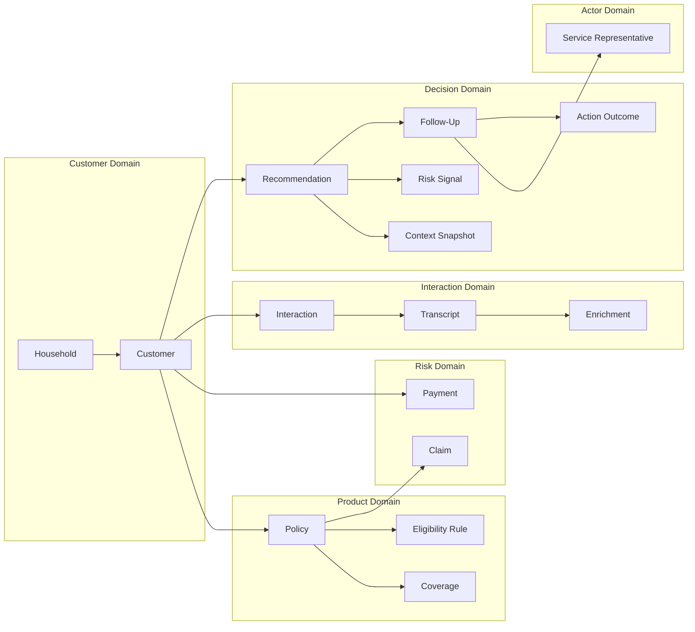

# Data Model — Customer 360 and Next Best Action

This document translates the business ontology (`docs/ontology.md`) into a data model spanning conceptual, logical, and proposed physical layers for Snowflake. No executable DDL is included — this is the design specification from which DDL will be generated.

---

## 1. Conceptual Model

The conceptual model captures subject areas and their high-level relationships without attributes or keys.



**Subject areas:**
- **Customer Domain** — identity and household grouping
- **Product Domain** — what the customer has purchased and what rules govern actions
- **Risk Domain** — financial signals (claims loss, payment behavior)
- **Interaction Domain** — communications and their AI-derived enrichments
- **Decision Domain** — the NBA lifecycle from recommendation through outcome
- **Actor Domain** — the human decision-maker

---

## 2. Logical Model

The logical model specifies entities, attributes, data types (platform-independent), and keys without physical storage concerns.

### 2.1 Household

| Attribute | Type | Nullable | Description |
|-----------|------|----------|-------------|
| household_id | identifier | No | Business key — stable carrier-assigned |
| address_line_1 | string(200) | No | Primary address |
| city | string(100) | No | |
| state | string(2) | No | US state code |
| postal_code | string(10) | No | |

**Grain:** One row per household.

---

### 2.2 Customer

| Attribute | Type | Nullable | Description |
|-----------|------|----------|-------------|
| customer_id | identifier | No | Business key — carrier-assigned |
| household_id | identifier | No | FK → Household |
| first_name | string(100) | No | |
| last_name | string(100) | No | |
| date_of_birth | date | Yes | Optional in synthetic data |
| email | string(200) | Yes | |
| phone | string(20) | Yes | |
| customer_since | date | No | Relationship start date |
| status | enum(active, inactive, prospect) | No | Current customer status |

**Grain:** One row per customer.

**Modeling decision:** Customer is an individual, not a household. Joint policyholders are modeled as separate customers in the same household. This avoids multi-valued identity problems and keeps the 360 view per-person.

---

### 2.3 Policy

| Attribute | Type | Nullable | Description |
|-----------|------|----------|-------------|
| policy_id | identifier | No | Business key — policy number |
| customer_id | identifier | No | FK → Customer |
| product_type | enum(auto, home, umbrella, renters) | No | Line of business |
| status | enum(quoted, bound, active, renewed, lapsed, cancelled) | No | Current lifecycle state |
| effective_date | date | No | Coverage start |
| expiration_date | date | No | Coverage end / renewal date |
| premium_amount | decimal(12,2) | No | Annual premium |
| payment_frequency | enum(monthly, quarterly, semi_annual, annual) | No | |
| bound_date | date | Yes | When policy was bound (null if quoted) |

**Grain:** One row per policy term. A renewed policy creates a new row with a new policy_id; the prior policy transitions to status = 'renewed'.

**Modeling decision:** Renewal creates a new policy record rather than updating in place. This preserves history without SCD complexity for the policy term itself. The prior policy's status changes to 'renewed' and a new policy begins. This avoids overwriting expiration_date, which is a key NBA signal.

---

### 2.4 Coverage

| Attribute | Type | Nullable | Description |
|-----------|------|----------|-------------|
| coverage_id | identifier | No | Surrogate — no natural business key at this grain |
| policy_id | identifier | No | FK → Policy |
| coverage_type | string(50) | No | e.g., liability, collision, comprehensive, dwelling, personal_property |
| limit_amount | decimal(12,2) | No | Maximum coverage limit |
| deductible_amount | decimal(12,2) | No | Customer responsibility |

**Grain:** One row per coverage component per policy.

---

### 2.5 Claim

| Attribute | Type | Nullable | Description |
|-----------|------|----------|-------------|
| claim_id | identifier | No | Business key — claim number |
| policy_id | identifier | No | FK → Policy |
| customer_id | identifier | No | FK → Customer (denormalized for query convenience) |
| filed_date | date | No | When claim was submitted |
| status | enum(filed, under_review, settled, denied, withdrawn) | No | Current lifecycle state |
| loss_date | date | No | When the loss event occurred |
| loss_type | string(50) | No | e.g., collision, water_damage, theft, liability |
| reserve_amount | decimal(12,2) | Yes | Estimated payout (null until assessed) |
| paid_amount | decimal(12,2) | Yes | Actual payout (null until settled) |
| closed_date | date | Yes | Null if open |

**Grain:** One row per claim.

**Modeling decision:** `customer_id` is denormalized onto Claim (derivable via Policy) to avoid a join in the 360 assembly query. Acceptable because the relationship is immutable — a claim's customer never changes.

---

### 2.6 Payment

| Attribute | Type | Nullable | Description |
|-----------|------|----------|-------------|
| payment_id | identifier | No | Surrogate |
| customer_id | identifier | No | FK → Customer |
| policy_id | identifier | No | FK → Policy |
| due_date | date | No | When payment was due |
| paid_date | date | Yes | Null if unpaid |
| amount | decimal(12,2) | No | Amount due |
| amount_paid | decimal(12,2) | Yes | Actual amount remitted |
| status | enum(on_time, late, grace_period, missed, pending) | No | Derived from due_date vs paid_date |

**Grain:** One row per payment obligation (one per billing cycle per policy).

**Modeling decision:** `status` is derived but stored (not computed at query time) because the derivation rules involve grace-period windows that are product-specific. Computing at storage time is simpler and deterministic.

---

### 2.7 Interaction

| Attribute | Type | Nullable | Description |
|-----------|------|----------|-------------|
| interaction_id | identifier | No | Surrogate |
| customer_id | identifier | No | FK → Customer |
| channel | enum(phone, email, chat) | No | Communication medium |
| direction | enum(inbound, outbound, internal_note) | No | Who initiated |
| disposition | enum(inquiry, complaint, request, notification, general) | No | Interaction outcome type |
| interaction_date | timestamp | No | When the interaction occurred |
| duration_seconds | integer | Yes | Call duration (null for email/chat) |
| representative_id | identifier | Yes | FK → ServiceRepresentative (null for automated) |

**Grain:** One row per contact event.

---

### 2.8 Transcript

| Attribute | Type | Nullable | Description |
|-----------|------|----------|-------------|
| transcript_id | identifier | No | Surrogate |
| interaction_id | identifier | No | FK → Interaction (1:1) |
| content_type | enum(call_transcript, email_body, agent_note) | No | Source type |
| raw_text | text | No | Verbatim unstructured content |
| word_count | integer | No | For cost estimation and filtering |
| recording_consent_flag | boolean | No | Whether recording consent was captured |

**Grain:** One row per interaction that has textual content. Not every interaction has a transcript.

**Modeling decision:** Transcript is physically separated from Interaction (not just a nullable text column) because: (a) access tiers differ (Tier 2 vs. Tier 1), (b) the raw text is large and should not be scanned for queries that only need metadata, (c) Enrichment has a foreign key to Transcript specifically.

---

### 2.9 Enrichment

| Attribute | Type | Nullable | Description |
|-----------|------|----------|-------------|
| enrichment_id | identifier | No | Surrogate |
| transcript_id | identifier | No | FK → Transcript (1:1) |
| enrichment_status | enum(pending, completed, failed, not_applicable) | No | Processing state |
| sentiment_score | decimal(4,3) | Yes | Range: -1.000 to +1.000 (null if not completed) |
| sentiment_label | enum(positive, neutral, negative) | Yes | Derived from score threshold |
| extracted_topics | array of string | Yes | Key topics identified |
| key_phrases | array of string | Yes | Notable phrases extracted |
| model_identifier | string(100) | Yes | Which AI model produced this (provenance) |
| model_version | string(20) | Yes | Model version for reproducibility |
| enrichment_confidence | decimal(3,2) | Yes | Model's self-reported confidence (0.00–1.00) |
| processed_at | timestamp | Yes | When enrichment was produced |
| error_message | string(500) | Yes | Populated only if status = failed |

**Grain:** One row per transcript. Created when the transcript is ingested; updated when enrichment completes or fails.

**Modeling decision:** Enrichment is a separate entity (not columns on Transcript) because: (a) it has its own lifecycle (pending → completed/failed), (b) provenance metadata is substantial, (c) access tier may differ from raw transcript content, (d) fallback logic depends on enrichment_status, not on transcript existence.

---

### 2.10 Eligibility Rule

| Attribute | Type | Nullable | Description |
|-----------|------|----------|-------------|
| rule_id | identifier | No | Surrogate |
| product_type | enum(auto, home, umbrella, renters) | No | Which product this rule applies to |
| action_type | string(50) | No | Which NBA action this gates (e.g., loyalty_adjustment, escalate) |
| is_eligible | boolean | No | Whether this action is permitted for this product |
| rule_description | string(500) | No | Human-readable explanation |

**Grain:** One row per product_type × action_type combination.

**Modeling decision:** This is a reference/configuration table, not transactional. It's a simple lookup. EligibilityRules are not versioned in MVP — changes are treated as configuration updates. Production would add effective_date/end_date for temporal validity.

---

### 2.11 Service Representative

| Attribute | Type | Nullable | Description |
|-----------|------|----------|-------------|
| representative_id | identifier | No | Business key — employee ID |
| name | string(200) | No | Display name |
| role | enum(service_rep, retention_specialist, supervisor) | No | Role classification. MVP exercises service_rep only; other values exist for future-scope personas. |
| team | string(100) | Yes | Team assignment |
| active | boolean | No | Employment status |

**Grain:** One row per representative.

---

### 2.12 Recommendation

| Attribute | Type | Nullable | Description |
|-----------|------|----------|-------------|
| recommendation_id | identifier | No | Surrogate (UUID) |
| customer_id | identifier | No | FK → Customer |
| generated_at | timestamp | No | When the system produced this |
| action_type | string(50) | No | Recommended action (e.g., acknowledge_retain, escalate, standard_renewal) |
| action_description | text | No | Full action text shown to rep |
| confidence_level | enum(high, medium_high, medium, low) | No | Overall confidence |
| confidence_score | decimal(3,2) | No | Numeric confidence (0.00–1.00) |
| alternatives | variant/json | No | Array of alternative actions with descriptions |
| evidence_payload | variant/json | No | Structured evidence (signals, source refs, completeness) |
| context_snapshot_id | identifier | No | FK → ContextSnapshot |
| eligibility_rules_evaluated | variant/json | No | Which rules were checked and their results |
| session_id | identifier | No | Links to the application session |

**Grain:** One row per recommendation event (one per customer per decision-support session).

**Modeling decision:** `evidence_payload` and `alternatives` are stored as semi-structured (VARIANT) because their schema is flexible (variable number of signals, variable evidence depth) and they are read as a unit, never queried column-by-column. This is a document-within-a-row pattern appropriate for Snowflake's VARIANT handling.

---

### 2.13 Context Snapshot

| Attribute | Type | Nullable | Description |
|-----------|------|----------|-------------|
| context_snapshot_id | identifier | No | Surrogate (UUID) |
| customer_id | identifier | No | FK → Customer |
| captured_at | timestamp | No | When the snapshot was frozen |
| snapshot_data | variant/json | No | Complete 360 state as JSON document |
| data_completeness | variant/json | No | Which sources were available vs. missing |

**Grain:** One row per recommendation generation event.

**Modeling decision:** The snapshot is stored as a single JSON document (not normalized) because its purpose is audit replay. It must reproduce exactly what the rep saw, regardless of how underlying tables have changed since. Normalizing it would create a parallel fact model with no query benefit.

---

### 2.14 Follow-Up

| Attribute | Type | Nullable | Description |
|-----------|------|----------|-------------|
| follow_up_id | identifier | No | Surrogate (UUID) |
| recommendation_id | identifier | No | FK → Recommendation (1:1 when exists) |
| representative_id | identifier | No | FK → ServiceRepresentative |
| decision | enum(approved, modified) | No | What the rep chose |
| action_taken | text | No | The actual action (same as recommendation if approved, modified text if modified) |
| modification_notes | text | Yes | Why the rep modified (null if approved as-is) |
| decided_at | timestamp | No | When the rep clicked accept/modify |

**Grain:** One row per approved or modified recommendation.

**Modeling decision:** Rejections are NOT stored in Follow-Up — they are logged in a separate lightweight audit event table. This keeps Follow-Up clean: every row represents a committed action, not a non-event.

---

### 2.15 Action Outcome

| Attribute | Type | Nullable | Description |
|-----------|------|----------|-------------|
| outcome_id | identifier | No | Surrogate (UUID) |
| follow_up_id | identifier | No | FK → Follow-Up (1:1 when exists) |
| outcome_type | enum(renewed, lapsed, escalated, no_change, unknown) | No | What eventually happened |
| observed_date | date | No | When the outcome was detected |
| attribution_method | enum(direct, correlated, unknown) | No | Causal confidence |
| attribution_confidence | enum(high, medium, low) | No | |
| confounders_noted | text | Yes | Known alternative explanations |

**Grain:** One row per follow-up, recorded asynchronously.

---

## 3. Proposed Physical Snowflake Model

### 3.1 Database and Schema Layout

**Logical layers (six):**
```
1. RAW                    -- Landing zone: ingested as-is from source
2. CURATED                -- Cleaned, typed, deduplicated, referentially intact
3. AI_ENRICHED            -- Cortex-processed: sentiment, topics, key phrases
4. SERVING                -- 360 views, risk computations, NBA-ready structures
5. DECISION               -- Recommendations, follow-ups, outcomes, audit
6. CONFIG                 -- Eligibility rules, signal weights, action library
```

**MVP physical schemas (three):**
```
CUSTOMER360_DB
├── RAW                    -- Layers 1 (landing zone)
├── ANALYTICS              -- Layers 2–4 + 6 collapsed (curated, enriched, serving, config)
└── DECISION               -- Layer 5 (immutable audit)
```

**Reconciliation:** The six logical layers describe data maturity stages and access tiers. For the MVP prototype, layers 2–4 and 6 are implemented within a single ANALYTICS schema to reduce grant surface and operational complexity (see `docs/architecture.md` §3). The logical separation is preserved conceptually; physical schema separation is a production enhancement documented in architecture.md §14.

### 3.2 Physical Table Mapping

| Schema | Table | Source Entity | Storage Pattern |
|--------|-------|---------------|-----------------|
| RAW | RAW_CUSTOMERS | Customer | Append-only landing |
| RAW | RAW_POLICIES | Policy | Append-only landing |
| RAW | RAW_COVERAGES | Coverage | Append-only landing |
| RAW | RAW_CLAIMS | Claim | Append-only landing |
| RAW | RAW_PAYMENTS | Payment | Append-only landing |
| RAW | RAW_INTERACTIONS | Interaction | Append-only landing |
| RAW | RAW_TRANSCRIPTS | Transcript | Append-only landing |
| CURATED | DIM_HOUSEHOLD | Household | SCD Type 1 (address updates overwrite) |
| CURATED | DIM_CUSTOMER | Customer | SCD Type 2 (status changes tracked) |
| CURATED | DIM_POLICY | Policy | SCD Type 2 (status lifecycle tracked) |
| CURATED | DIM_COVERAGE | Coverage | SCD Type 1 (limit changes overwrite) |
| CURATED | DIM_SERVICE_REPRESENTATIVE | ServiceRepresentative | SCD Type 1 |
| CURATED | FACT_CLAIM | Claim | Append-only fact |
| CURATED | FACT_PAYMENT | Payment | Append-only fact |
| CURATED | FACT_INTERACTION | Interaction | Append-only fact |
| AI_ENRICHED | TRANSCRIPT_CONTENT | Transcript | Separate from metadata for access control |
| AI_ENRICHED | ENRICHMENT_RESULT | Enrichment | Updated in place (status lifecycle) |
| SERVING | CUSTOMER_360_VIEW | (derived) | Dynamic table — the unified serving view |
| SERVING | CUSTOMER_RISK_SIGNALS | (computed) | Ephemeral/materialized per refresh |
| DECISION | RECOMMENDATION_LOG | Recommendation | Append-only, immutable |
| DECISION | CONTEXT_SNAPSHOT | ContextSnapshot | Append-only, immutable |
| DECISION | FOLLOW_UP_LOG | Follow-Up | Append-only |
| DECISION | ACTION_OUTCOME | ActionOutcome | Append-only |
| DECISION | DECISION_AUDIT_EVENT | (audit trail) | Append-only (includes rejections) |
| CONFIG | ELIGIBILITY_RULES | EligibilityRule | Reference table |
| CONFIG | ACTION_LIBRARY | (action definitions) | Reference table |
| CONFIG | SIGNAL_WEIGHTS | (configuration) | Reference table |

---

## 4. Entity Grain

| Entity | Grain Statement | Uniqueness |
|--------|----------------|------------|
| Household | One row per residential address grouping | household_id |
| Customer | One row per individual person | customer_id |
| Policy | One row per policy term (renewal = new row) | policy_id |
| Coverage | One row per coverage component per policy | coverage_id (surrogate) |
| Claim | One row per claim event | claim_id |
| Payment | One row per billing obligation per cycle | payment_id (surrogate) |
| Interaction | One row per contact event | interaction_id (surrogate) |
| Transcript | One row per interaction with text content | transcript_id (surrogate); unique on interaction_id |
| Enrichment | One row per transcript | enrichment_id (surrogate); unique on transcript_id |
| EligibilityRule | One row per product × action combination | rule_id (surrogate); unique on product_type + action_type |
| Recommendation | One row per NBA generation event | recommendation_id (UUID) |
| ContextSnapshot | One row per recommendation | context_snapshot_id (UUID); unique on recommendation_id |
| Follow-Up | One row per approved/modified recommendation | follow_up_id (UUID); unique on recommendation_id |
| ActionOutcome | One row per follow-up | outcome_id (UUID); unique on follow_up_id |
| ServiceRepresentative | One row per employee | representative_id |

---

## 5. Business and Surrogate Keys

| Entity | Business Key | Surrogate Key | Rationale |
|--------|-------------|---------------|-----------|
| Household | household_id (carrier-assigned) | None needed — BK is stable and compact | Carrier systems assign household IDs |
| Customer | customer_id (carrier-assigned) | None needed | Same rationale |
| Policy | policy_id (policy number) | None needed | Policy numbers are globally unique within a carrier |
| Coverage | None (no natural key at this grain) | coverage_id (sequence) | Coverages are identified by parent policy + type, but type is not unique within a policy |
| Claim | claim_id (claim number) | None needed | Claim numbers are globally unique |
| Payment | None (compound: policy_id + due_date) | payment_id (sequence) | Compound key is cumbersome for joins; surrogate simplifies |
| Interaction | None (customer_id + timestamp is near-unique but not guaranteed) | interaction_id (sequence) | Timestamp collisions possible; surrogate is cleaner |
| Transcript | None (1:1 with interaction) | transcript_id (sequence) | Keeps FK relationships simple |
| Enrichment | None (1:1 with transcript) | enrichment_id (sequence) | Same rationale |
| Recommendation | None (system-generated event) | recommendation_id (UUID) | UUIDs for immutable audit records; no business-meaningful key exists |
| ContextSnapshot | None | context_snapshot_id (UUID) | Paired with recommendation |
| Follow-Up | None | follow_up_id (UUID) | Paired with recommendation |
| ActionOutcome | None | outcome_id (UUID) | Paired with follow-up |
| ServiceRepresentative | representative_id (employee ID) | None needed | Carrier HR system provides stable IDs |

**Modeling decision:** UUIDs are used for Decision-domain entities because they are append-only audit records that may be generated by multiple application instances concurrently. Sequences risk collision in distributed generation; UUIDs are globally unique without coordination.

---

## 6. Relationships (Physical Foreign Keys)

| Parent Table | Child Table | FK Column | Cardinality | Enforced? |
|-------------|-------------|-----------|-------------|-----------|
| DIM_HOUSEHOLD | DIM_CUSTOMER | household_id | 1:N | Logical only |
| DIM_CUSTOMER | DIM_POLICY | customer_id | 1:N | Logical |
| DIM_POLICY | DIM_COVERAGE | policy_id | 1:N | Logical |
| DIM_POLICY | FACT_CLAIM | policy_id | 1:N | Logical |
| DIM_CUSTOMER | FACT_CLAIM | customer_id | 1:N | Logical (denormalized) |
| DIM_CUSTOMER | FACT_PAYMENT | customer_id | 1:N | Logical |
| DIM_POLICY | FACT_PAYMENT | policy_id | 1:N | Logical |
| DIM_CUSTOMER | FACT_INTERACTION | customer_id | 1:N | Logical |
| FACT_INTERACTION | TRANSCRIPT_CONTENT | interaction_id | 1:0..1 | Logical |
| TRANSCRIPT_CONTENT | ENRICHMENT_RESULT | transcript_id | 1:0..1 | Logical |
| DIM_CUSTOMER | RECOMMENDATION_LOG | customer_id | 1:N | Logical |
| RECOMMENDATION_LOG | CONTEXT_SNAPSHOT | recommendation_id | 1:1 | Logical |
| RECOMMENDATION_LOG | FOLLOW_UP_LOG | recommendation_id | 1:0..1 | Logical |
| DIM_SERVICE_REPRESENTATIVE | FOLLOW_UP_LOG | representative_id | 1:N | Logical |
| FOLLOW_UP_LOG | ACTION_OUTCOME | follow_up_id | 1:0..1 | Logical |

**Modeling decision:** Snowflake does not enforce foreign keys at runtime. FKs are declared for documentation, optimizer hints, and metadata tooling (semantic models, BI tools). Referential integrity is enforced at the pipeline level via data-quality rules (Section 13).

---

## 7. Slowly Changing Dimensions

| Dimension | SCD Type | Justification |
|-----------|----------|---------------|
| DIM_HOUSEHOLD | Type 1 (overwrite) | Address changes are corrections, not history-bearing. If the address changes, the household identity effectively changes. MVP does not need historical address tracking. |
| DIM_CUSTOMER | Type 2 (versioned) | Customer status changes (active → inactive) are history-bearing. The 360 view needs to know *when* a customer's status changed. |
| DIM_POLICY | Type 2 (versioned) | Policy status lifecycle (active → renewed/lapsed/cancelled) must be preserved for temporal queries ("was the policy active at the time of this interaction?"). |
| DIM_COVERAGE | Type 1 (overwrite) | Coverage limit changes are corrections/adjustments. Historical coverage amounts are not needed for the NBA decision in MVP. |
| DIM_SERVICE_REPRESENTATIVE | Type 1 (overwrite) | Team reassignments and name changes are not analytically significant for MVP. |

**Modeling decision:** SCD Type 2 is applied only where the NBA engine or 360 view explicitly needs temporal state. Over-applying SCD2 creates storage bloat and join complexity without analytical benefit in a prototype.

### SCD Type 2 Implementation Pattern

For DIM_CUSTOMER and DIM_POLICY:

| Column | Purpose |
|--------|---------|
| `_surrogate_key` | Sequence — row-level unique identifier for the version |
| `[business_key]` | The natural key (customer_id, policy_id) — repeats across versions |
| `valid_from` | Timestamp when this version became current |
| `valid_to` | Timestamp when this version was superseded (NULL = current) |
| `is_current` | Boolean flag for convenience (redundant with valid_to IS NULL) |

---

## 8. Fact and Dimension Candidates

### Dimensions (descriptive context, low change rate)

| Table | Dimension Role | Conformed? |
|-------|---------------|------------|
| DIM_HOUSEHOLD | Groups customers for multi-policy analysis | Yes — shared across all facts |
| DIM_CUSTOMER | Central entity; conformed across all facts | Yes |
| DIM_POLICY | Product context for claims, payments, interactions | Yes |
| DIM_COVERAGE | Detail-level product attributes | Policy-specific |
| DIM_SERVICE_REPRESENTATIVE | Actor context for follow-ups | Yes |
| ELIGIBILITY_RULES | Reference/configuration dimension | Config-only |
| ACTION_LIBRARY | Reference dimension for NBA action types | Config-only |

### Facts (events, measurements, append-only)

| Table | Fact Type | Grain | Key Measures |
|-------|-----------|-------|-------------|
| FACT_CLAIM | Transaction fact | One row per claim | reserve_amount, paid_amount, days_open |
| FACT_PAYMENT | Transaction fact | One row per billing obligation | amount, amount_paid, days_late |
| FACT_INTERACTION | Event fact | One row per contact event | duration_seconds, sentiment_score (via enrichment join) |
| RECOMMENDATION_LOG | Event fact (immutable) | One row per NBA generation | confidence_score |
| FOLLOW_UP_LOG | Event fact (immutable) | One row per approved/modified action | (qualitative — no numeric measure) |
| ACTION_OUTCOME | Event fact (immutable) | One row per observed outcome | (qualitative) |

**Modeling decision:** The Decision-domain tables (RECOMMENDATION_LOG, FOLLOW_UP_LOG, ACTION_OUTCOME) are classified as facts because they are event-grained, append-only, and timestamped. They have no numeric measures in the traditional sense but are analyzable (counts, rates, cohort comparisons). This is a factless-fact pattern common in customer journey analytics.

---

## 9. Data Layers

### Layer 1 — RAW (Landing Zone)

| Characteristic | Detail |
|---------------|--------|
| **Purpose** | Preserve source data exactly as received |
| **Schema** | RAW |
| **Processing** | None — data arrives via synthetic generation scripts or COPY INTO |
| **Retention** | Permanent (enables reprocessing) |
| **Access** | DATA_ENGINEER role only |
| **Quality enforcement** | None — accept all data; quality is enforced downstream |

### Layer 2 — CURATED (Cleaned and Typed)

| Characteristic | Detail |
|---------------|--------|
| **Purpose** | Apply data types, enforce constraints, deduplicate, apply SCD logic |
| **Schema** | CURATED |
| **Processing** | Dynamic tables or tasks reading from RAW |
| **Quality enforcement** | NOT NULL checks, type casting, deduplication, referential integrity validation |
| **Access** | DATA_ENGINEER role; read-only to downstream layers |

### Layer 3 — AI_ENRICHED (Cortex-Processed)

| Characteristic | Detail |
|---------------|--------|
| **Purpose** | Apply Cortex AI functions to transcripts; store results with provenance |
| **Schema** | AI_ENRICHED |
| **Processing** | Dynamic table or task calling SNOWFLAKE.CORTEX.SENTIMENT(), EXTRACT_ANSWER(), SUMMARIZE() |
| **Tables** | TRANSCRIPT_CONTENT (raw text, access-controlled), ENRICHMENT_RESULT (derived signals) |
| **Access** | TRANSCRIPT_CONTENT: Tier 2 (rep during session). ENRICHMENT_RESULT: Tier 1 (rep, auditor). |
| **Fallback** | If enrichment fails, status = 'failed'; downstream layers operate without sentiment signals |

### Layer 4 — SERVING (360 Views and Risk Computation)

| Characteristic | Detail |
|---------------|--------|
| **Purpose** | Pre-joined, query-optimized structures for the application layer |
| **Schema** | SERVING |
| **Key objects** | CUSTOMER_360_VIEW (dynamic table), CUSTOMER_RISK_SIGNALS (computed view or dynamic table) |
| **Processing** | Dynamic tables joining CURATED + AI_ENRICHED with business logic |
| **Access** | SERVICE_REP role (primary consumer), AUDITOR role (read-only) |
| **Latency target** | < 5 seconds query response for any single customer |

### Layer 5 — DECISION (Audit and Outcomes)

| Characteristic | Detail |
|---------------|--------|
| **Purpose** | Immutable record of all NBA system decisions and their outcomes |
| **Schema** | DECISION |
| **Tables** | RECOMMENDATION_LOG, CONTEXT_SNAPSHOT, FOLLOW_UP_LOG, ACTION_OUTCOME, DECISION_AUDIT_EVENT |
| **Access** | Write: application service account. Read: AUDITOR role. SERVICE_REP can read their own decisions only. |
| **Immutability** | No UPDATE or DELETE permitted. Append-only by design. |

### Layer 6 — CONFIG (Reference Data)

| Characteristic | Detail |
|---------------|--------|
| **Purpose** | System configuration: eligibility rules, signal weights, action definitions |
| **Schema** | CONFIG |
| **Tables** | ELIGIBILITY_RULES, ACTION_LIBRARY, SIGNAL_WEIGHTS |
| **Access** | DATA_ENGINEER role (read/write). Application reads at runtime. |
| **Change management** | Changes logged via standard Snowflake TIME TRAVEL (no separate audit table needed for config) |

---

## 10. Customer 360 Serving Structure

The `SERVING.CUSTOMER_360_VIEW` is the primary object consumed by the Streamlit application. It is a dynamic table that pre-joins across layers.

### Proposed Column Groups

| Group | Columns | Source |
|-------|---------|--------|
| **Identity** | customer_id, first_name, last_name, household_id, customer_since, status | DIM_CUSTOMER |
| **Household context** | household_member_count, total_household_policies | DIM_HOUSEHOLD + DIM_POLICY (aggregated) |
| **Policy summary** | active_policy_count, product_types (array), nearest_renewal_date, days_to_nearest_renewal | DIM_POLICY (aggregated, filtered to is_current) |
| **Payment status** | last_payment_date, missed_payment_count_12m, late_payment_count_12m, payment_status_current | FACT_PAYMENT (aggregated, windowed) |
| **Claims summary** | open_claim_count, claims_filed_12m, total_paid_12m | FACT_CLAIM (aggregated, windowed) |
| **Interaction summary** | total_interactions_12m, last_interaction_date, last_interaction_channel, negative_interaction_count_90d | FACT_INTERACTION + ENRICHMENT_RESULT (aggregated, windowed) |
| **Sentiment trend** | avg_sentiment_90d, avg_sentiment_prior_90d, sentiment_direction | ENRICHMENT_RESULT (windowed comparison) |
| **Data completeness** | enrichment_coverage_pct (% of recent interactions with completed enrichment) | ENRICHMENT_RESULT (aggregated) |

### Dynamic Table Specification (Conceptual)

```
SERVING.CUSTOMER_360_VIEW
  TARGET_LAG = '1 minute'
  WAREHOUSE = CUSTOMER360_WH
  AS SELECT ...
```

**Modeling decision:** The 360 view is a wide, pre-aggregated dynamic table rather than a runtime multi-join query because: (a) the aggregations (counts, averages, window comparisons) are compute-intensive, (b) the Streamlit app needs sub-5-second response, (c) dynamic table incremental refresh handles new data without full recomputation. TARGET_LAG = '1 minute' is the prototype freshness objective (not a guaranteed interval). Production would increase to 15 minutes to reduce compute cost.

---

## 11. Recommendation and Action History

### DECISION.RECOMMENDATION_LOG

Stores every NBA generation event, immutable. One row per recommendation regardless of whether it was accepted.

### DECISION.FOLLOW_UP_LOG

Stores every approved or modified action. One row per committed decision.

### DECISION.DECISION_AUDIT_EVENT

A lightweight event table capturing *all* decision touchpoints including rejections:

| Column | Description |
|--------|-------------|
| event_id | UUID |
| recommendation_id | FK → RECOMMENDATION_LOG |
| event_type | enum(presented, approved, modified, rejected, timeout) |
| representative_id | Who was presented the recommendation |
| event_timestamp | When |
| metadata | VARIANT — additional context (rejection reason, modification text, timeout duration) |

**Modeling decision:** Rejections and timeouts (rep didn't act) are tracked here rather than in FOLLOW_UP_LOG because Follow-Up represents committed actions only. This table is the complete audit trail; FOLLOW_UP_LOG is the subset that represents positive decisions.

### DECISION.ACTION_OUTCOME

Linked back to FOLLOW_UP_LOG. Populated asynchronously when outcome events (renewal, lapse) are detected in the policy system.

### Query Pattern: Full Decision History

```sql
-- Conceptual join path (not executable DDL)
RECOMMENDATION_LOG
  JOIN CONTEXT_SNAPSHOT ON recommendation_id
  LEFT JOIN FOLLOW_UP_LOG ON recommendation_id
  LEFT JOIN ACTION_OUTCOME ON follow_up_id
  JOIN DECISION_AUDIT_EVENT ON recommendation_id
```

This gives the complete lifecycle: what was suggested → what the rep saw → what they decided → what happened.

---

## 12. Source-to-Target Outline

| Source (Synthetic Generator) | Target (RAW) | Target (CURATED) | Target (SERVING) |
|------------------------------|-------------|------------------|-----------------|
| Customer seed data | RAW_CUSTOMERS | DIM_CUSTOMER (SCD2) | CUSTOMER_360_VIEW.identity |
| Household seed data | RAW_CUSTOMERS (embedded) | DIM_HOUSEHOLD (extracted) | CUSTOMER_360_VIEW.household_context |
| Policy seed data | RAW_POLICIES | DIM_POLICY (SCD2) | CUSTOMER_360_VIEW.policy_summary |
| Coverage seed data | RAW_COVERAGES | DIM_COVERAGE | (joined into 360 if needed) |
| Claim seed data | RAW_CLAIMS | FACT_CLAIM | CUSTOMER_360_VIEW.claims_summary |
| Payment seed data | RAW_PAYMENTS | FACT_PAYMENT | CUSTOMER_360_VIEW.payment_status |
| Interaction seed data | RAW_INTERACTIONS | FACT_INTERACTION | CUSTOMER_360_VIEW.interaction_summary |
| Transcript seed data | RAW_TRANSCRIPTS | AI_ENRICHED.TRANSCRIPT_CONTENT | → ENRICHMENT_RESULT → CUSTOMER_360_VIEW.sentiment_trend |
| (Application generates) | — | — | DECISION.RECOMMENDATION_LOG |
| (Application generates) | — | — | DECISION.CONTEXT_SNAPSHOT |
| (Application generates) | — | — | DECISION.FOLLOW_UP_LOG |
| (Policy system event) | — | — | DECISION.ACTION_OUTCOME |

### Pipeline Flow

```
Synthetic Generator
    │
    ▼
RAW tables (COPY INTO or INSERT)
    │
    ▼ [Dynamic Table or Task]
CURATED dimensions + facts (cleaned, typed, SCD applied)
    │
    ▼ [Dynamic Table or Task]
AI_ENRICHED (Cortex functions applied to transcripts)
    │
    ▼ [Dynamic Table]
SERVING.CUSTOMER_360_VIEW (pre-aggregated)
    │
    ▼ [Application runtime]
DECISION tables (written by Streamlit app on user action)
```

---

## 13. Data-Quality Rules

| # | Rule | Layer | Enforcement | Severity |
|---|------|-------|-------------|----------|
| DQ1 | Every customer_id in FACT_* tables exists in DIM_CUSTOMER | CURATED | Pipeline validation query | Hard — reject row |
| DQ2 | Every policy_id in FACT_CLAIM, FACT_PAYMENT exists in DIM_POLICY | CURATED | Pipeline validation query | Hard — reject row |
| DQ3 | Every interaction_id in TRANSCRIPT_CONTENT exists in FACT_INTERACTION | AI_ENRICHED | Pipeline validation query | Hard — reject row |
| DQ4 | sentiment_score is within [-1.0, +1.0] when enrichment_status = 'completed' | AI_ENRICHED | CHECK-style assertion in pipeline | Hard — set status to 'failed' |
| DQ5 | enrichment_status is NOT NULL for every row in ENRICHMENT_RESULT | AI_ENRICHED | NOT NULL constraint | Hard |
| DQ6 | days_to_nearest_renewal is non-negative in CUSTOMER_360_VIEW | SERVING | Computed-column validation | Soft — flag for investigation |
| DQ7 | No duplicate recommendation_id in RECOMMENDATION_LOG | DECISION | UNIQUE constraint (logical) + dedup in application | Hard — reject duplicate |
| DQ8 | Every follow_up_id in ACTION_OUTCOME exists in FOLLOW_UP_LOG | DECISION | Pipeline validation | Hard — reject row |
| DQ9 | Enrichment processed_at is after the corresponding interaction_date | AI_ENRICHED | Temporal consistency check | Soft — flag for investigation |
| DQ10 | At least one coverage row exists for every active policy | CURATED | Referential completeness check | Soft — warning |
| DQ11 | payment.amount > 0 | CURATED | Range check | Hard — reject row |
| DQ12 | Customer valid_from < valid_to for all non-current SCD2 rows | CURATED | Temporal integrity check | Hard — reject row |
| DQ13 | No duplicate `_source_event_id` within INTERACTIONS_ENRICHED | AI_ENRICHED | Unique constraint on source_event_id | Hard — skip duplicate |
| DQ14 | `_processed_at` is after `_ingested_at` for every row | All layers | Temporal ordering check | Soft — flag for investigation |
| DQ15 | CUSTOMER_360 refresh timestamp is within TARGET_LAG objective of upstream changes | SERVING | Compare DT DATA_TIMESTAMP to MAX(_ingested_at) in upstream | Soft — freshness breach alert (not a hard failure — TARGET_LAG is a freshness objective, not a guarantee) |

**Enforcement approach:** Hard rules block downstream processing (the record is quarantined or rejected). Soft rules log warnings but allow the record through. In MVP with synthetic data, all rules should pass by construction — the rules document *intent* for production robustness.

---

## 14. Audit and Lineage Columns

Every table in CURATED, AI_ENRICHED, SERVING, and DECISION schemas carries standard audit columns:

| Column | Type | Purpose |
|--------|------|---------|
| `_loaded_at` | TIMESTAMP_NTZ | When this row was written to this table |
| `_source_event_id` | STRING | The originating record's natural identifier (e.g., interaction_id, transcript_id). Used for deduplication: if this value already exists in the target, the row is not reprocessed. |
| `_ingested_at` | TIMESTAMP_NTZ | When the source record first arrived in RAW (preserves original ingestion time across downstream hops) |
| `_processed_at` | TIMESTAMP_NTZ | When this specific pipeline stage processed the record (differs from _loaded_at for dynamic tables where the DT refresh time is the processing time) |
| `_pipeline_run_id` | STRING | Identifier of the task/DT refresh that produced this row |
| `_row_hash` | STRING | SHA-256 hash of business columns. Used for incremental change detection: a record is reprocessed only if its hash differs from the previously stored hash for the same source_event_id. |
| `_source_table` | STRING | Which RAW or upstream table produced this row |

### Additional columns by schema

**AI_ENRICHED.ENRICHMENT_RESULT:**

| Column | Purpose |
|--------|---------|
| `_model_identifier` | Which Cortex function/model produced the enrichment |
| `_model_version` | Version string for reproducibility |
| `_processing_duration_ms` | How long enrichment took (cost/performance monitoring) |

**DECISION schema (all tables):**

| Column | Purpose |
|--------|---------|
| `_created_by` | Application service account or user identity that wrote the row |
| `_immutable` | Always TRUE — documents that this row must never be updated |

**Modeling decision:** Audit columns use underscore prefix (`_loaded_at`) to visually distinguish system metadata from business attributes. This is a convention that helps application developers and semantic model authors exclude non-business columns.

---

## Modeling Decision Summary

| # | Decision | Rationale |
|---|----------|-----------|
| M1 | Renewal creates a new policy row (not in-place update) | Preserves historical state; avoids overwriting expiration_date which is a key risk signal |
| M2 | customer_id denormalized onto FACT_CLAIM | Immutable relationship; avoids a join through DIM_POLICY for every 360 query |
| M3 | Payment.status derived but stored | Grace-period rules are product-specific; storing avoids runtime business-logic in every query |
| M4 | Transcript physically separated from Interaction | Access tiers differ; text is large; enrichment FK targets transcript specifically |
| M5 | Enrichment is a separate table from Transcript | Own lifecycle, own provenance, own access tier |
| M6 | evidence_payload stored as VARIANT | Variable-length structured data read as a unit; not queried column-by-column |
| M7 | ContextSnapshot stored as JSON blob | Purpose is audit replay of exact state; normalizing serves no query need |
| M8 | UUIDs for Decision-domain PKs | Concurrent write safety without coordination; append-only audit records |
| M9 | Rejections in DECISION_AUDIT_EVENT, not FOLLOW_UP_LOG | Follow-Up = committed action; audit event = all touchpoints including non-actions |
| M10 | Dynamic table for CUSTOMER_360_VIEW | Pre-aggregation for sub-5s response; 1-minute freshness objective for prototype; 15-min as production cost optimization |
| M11 | SCD2 only for Customer and Policy | Only these have history-bearing state transitions relevant to the NBA decision |
| M12 | FKs declared but not enforced | Snowflake pattern; integrity enforced at pipeline level via DQ rules |
| M13 | Six logical layers, three MVP physical schemas | Logical separation documents access tiers and data maturity; physical collapse to RAW/ANALYTICS/DECISION reduces grant surface for prototype |

---

*Document version: v1.2 — Consistency correction: reconciled 6 logical layers with 3 physical schemas, aligned TARGET_LAG to 1 minute (prototype), clarified service_rep as only MVP role, updated M10 and M13.*
