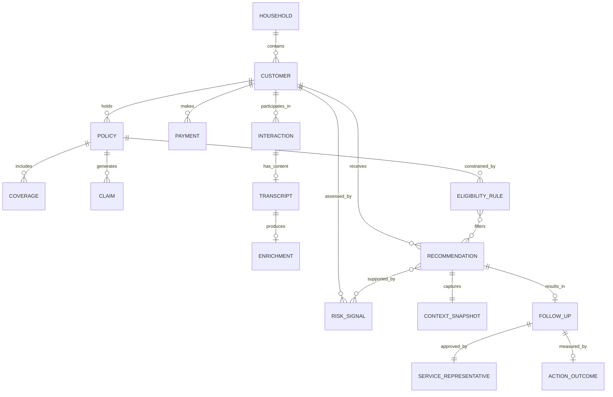

# Ontology — Customer 360 and Next Best Action

## Purpose and Scope

This ontology defines the business concepts, relationships, rules, and lifecycles required to support the MVP decision: **the safest Next Best Action for a service representative during an inbound interaction where the customer has expressed negative sentiment and their policy renewal is approaching.**

This is a business-concept model, not a database schema. Physical table design follows in `docs/data-model.md` and may denormalize, partition, or reshape these concepts for query performance. The ontology is the source of truth for *what the concepts mean* and *how they relate*.

---

## 1. Business Concepts

### Included in MVP

| Concept | Definition |
|---------|-----------|
| **Customer** | An individual who holds or has held one or more insurance policies. The atomic unit of identity in the 360 view. Identified by a stable carrier-assigned ID. |
| **Household** | A group of customers sharing a residential address or explicit familial linkage. Policies may be bundled at household level. Membership is explicit (one customer belongs to exactly one household). In MVP, determined by shared address in synthetic data. |
| **Policy** | A contract between the carrier and a customer providing insurance coverage for a defined period and set of perils. Has a lifecycle: quoted → bound → active → renewal window → renewed/lapsed/cancelled. |
| **Coverage** | A specific protection component within a policy (e.g., liability, collision, dwelling). A policy contains one or more coverages with individual limits and deductibles. |
| **Claim** | A customer's formal request for payment under a policy following a covered loss event. Has a lifecycle: filed → under review → settled/denied/withdrawn. |
| **Payment** | A financial transaction representing premium payment from customer to carrier. Carries timing metadata: due date, paid date, on-time/late/grace-period status. |
| **Interaction** | Any contact event between the customer and the carrier. Attributes include channel (phone, email, chat), direction (inbound, outbound, internal_note), disposition (inquiry, complaint, request, notification), and timestamp. The temporal backbone of the 360 timeline. |
| **Transcript** | The verbatim text content of an interaction: call recording transcription, email body, or agent note. The raw unstructured input to enrichment. Preserved for evidence traceability. |
| **Enrichment** | A machine-derived annotation attached to a Transcript: sentiment score/label, extracted topics, key phrases. Always carries provenance metadata (model identifier, extraction timestamp, confidence score). Has an explicit status: pending, completed, failed, not_applicable. Labeled as AI-generated in all contexts. |
| **RiskSignal** | A named, computed indicator contributing to the risk assessment for a customer at a point in time. Attributes: signal_type, value, weight, recency, signal_direction (improving/stable/worsening), source_reference. Ephemeral — recomputed per session, not persisted as historical time-series. |
| **EligibilityRule** | A set of business constraints per policy or product type that filter candidate actions. Boolean gate: an action is either eligible or not for a given policy. Not a full rules engine — determines whether a specific action type (e.g., loyalty adjustment) is permissible. |
| **Recommendation** | The system's suggested Next Best Action for a specific customer at a specific point in time. Contains: action type, evidence list (linked RiskSignals), confidence level, alternative actions. Immutable once generated. Exists only as a suggestion until a human acts on it. |
| **ContextSnapshot** | The frozen state of the Customer 360 assembly at the moment a Recommendation is generated. Captures exactly what the representative saw when making their decision. Stored with the Recommendation for audit replay. |
| **Follow-Up** | The record created when a service representative approves or modifies a recommendation. Represents the committed decision. Contains: action taken (original or modified), modification notes, representative identity, timestamp. Distinct from Recommendation (suggestion) and ActionOutcome (result). |
| **ActionOutcome** | The eventual result of a Follow-Up, recorded asynchronously (days or weeks later). Attributes: outcome_type (renewed, lapsed, escalated, no_change), observed_date, attribution_method (direct, correlated, unknown), confounders_noted. Used to close the feedback loop without claiming causation. |
| **ServiceRepresentative** | The human user of the decision-support application. Identified by role, identity, and session. The decision-maker in the human-in-the-loop gate. The only MVP persona. |

### Challenged and Excluded Concepts

| Concept | Challenge | Decision |
|---------|-----------|----------|
| **Agent (field/sales)** | Ambiguous: "agent" means field sales agent, AI agent, or software agent depending on context. MVP has one human actor (ServiceRepresentative). Field agents are a future-scope persona with different system access. | **Excluded.** Use ServiceRepresentative. Revisit when field-agent portal is in scope. |
| **Complaint (as separate entity)** | A complaint is an Interaction with disposition = "complaint." Modeling it separately creates a classification burden and a parallel lifecycle without clear MVP value. Complaint *themes* are captured via topic extraction in Enrichment. | **Absorbed into Interaction** via the `disposition` attribute. |
| **Consent (full marketing/communication)** | MVP has no outbound automated actions. The system advises a human who then acts through existing channels. Channel preferences, opt-out tracking, TCPA compliance, and do-not-contact flags are irrelevant when the system only *suggests*. | **Scoped narrowly.** MVP consent = interaction-recording acknowledgment + rep's explicit approval. Full consent management is future scope. |

### Concepts Identified as Missing (added above)

| Concept | Why absent from initial candidate list | Why needed |
|---------|---------------------------------------|-----------|
| **Enrichment** | Was treated as columns on Interaction rather than an independent concept. | Requires independent provenance, confidence, failure state, and fallback semantics. Access tier may differ from raw Transcript. |
| **RiskSignal** | Implied by "risk scoring" but not independently named. | Explainability requires individually addressable, weighted, directional signals with source references. |
| **EligibilityRule** | Not in the initial candidate list at all. | The NBA engine must filter ineligible actions. Without this concept, the system could recommend actions the policy doesn't permit. |
| **ContextSnapshot** | The 360 view was referenced but not captured as a point-in-time artifact. | Audit requires knowing exactly what the rep saw, not what the data looks like at audit time. |
| **Follow-Up** | Conflated with Recommendation in initial thinking. | Separating suggestion (system) from decision (human) is foundational for audit integrity and feedback accuracy. |
| **ActionOutcome** | Implied by "feedback loop" but not independently named or attributed. | Outcome measurement requires a distinct event with explicit attribution uncertainty. |

---

## 2. Relationships and Cardinalities

| From | To | Cardinality | Relationship |
|------|----|-------------|-------------|
| Household | Customer | 1 : many | A household contains one or more customers |
| Customer | Policy | 1 : many | A customer holds zero or more policies |
| Policy | Coverage | 1 : many | A policy includes one or more coverages |
| Policy | Claim | 1 : many | A policy generates zero or more claims |
| Policy | EligibilityRule | 1 : many | A policy is constrained by one or more eligibility rules |
| Customer | Payment | 1 : many | A customer makes zero or more payments |
| Customer | Interaction | 1 : many | A customer participates in zero or more interactions |
| Interaction | Transcript | 1 : 0..1 | An interaction has at most one transcript (some interactions have no text content) |
| Transcript | Enrichment | 1 : 0..1 | A transcript produces at most one enrichment record (may be pending, failed, or not applicable) |
| Customer | RiskSignal | 1 : many | A customer is assessed by zero or more computed risk signals (ephemeral) |
| Customer | Recommendation | 1 : many | A customer may receive multiple recommendations over time (one per decision-support session) |
| Recommendation | ContextSnapshot | 1 : 1 | Every recommendation captures exactly one context snapshot |
| Recommendation | RiskSignal | many : many | A recommendation is supported by one or more risk signals; a signal may support multiple recommendations over time |
| Recommendation | Follow-Up | 1 : 0..1 | A recommendation results in at most one follow-up (only if approved or modified) |
| EligibilityRule | Recommendation | many : many | Eligibility rules filter candidate actions within recommendations |
| Follow-Up | ServiceRepresentative | many : 1 | A follow-up is approved by exactly one service representative |
| Follow-Up | ActionOutcome | 1 : 0..1 | A follow-up is measured by at most one outcome (recorded asynchronously) |

---

## 3. Business Rules

| # | Rule | Enforcement |
|---|------|-------------|
| BR1 | A Recommendation is immutable once generated. If the representative modifies the suggested action, a Follow-Up record captures the modification. The original Recommendation is never edited. | Application logic + immutable table design |
| BR2 | A Follow-Up cannot exist without a preceding Recommendation. | Referential integrity (FK constraint) |
| BR3 | An Enrichment is never presented to the representative without its provenance: model identifier, extraction timestamp, and confidence score. | Application rendering logic |
| BR4 | If no Enrichment exists (status = pending or failed) for any of a customer's recent Transcripts, the system operates in fallback mode: structured signals only, sentiment-based RiskSignals are not computed, and no Recommendation is generated. The 360 context is still displayed. | NBA engine precondition check |
| BR5 | EligibilityRules are evaluated before scoring. An action that fails eligibility is excluded from the candidate set entirely — it is never shown as an alternative. | NBA engine filtering step |
| BR6 | RiskSignals include a `signal_direction` (improving/stable/worsening) computed by comparing the current observation window to the prior window. This enables trend expression without historical signal persistence. | Signal computation logic |
| BR7 | No customer-facing action is executed by the system. The Follow-Up records the representative's *decision*; execution happens through existing operational channels outside this system. | Architectural constraint — no outbound integrations in MVP |

---

## 4. Customer Lifecycle

```
┌──────────┐     ┌──────────────┐     ┌────────────────┐     ┌─────────────────┐
│ PROSPECT │ ──▶ │ POLICYHOLDER │ ──▶ │ ACTIVE         │ ──▶ │ RENEWAL WINDOW  │
│          │     │ (bound)      │     │ (in-force)     │     │ (MVP focus)     │
└──────────┘     └──────────────┘     └────────────────┘     └────────┬────────┘
                                                                       │
                                                          ┌────────────┼────────────┐
                                                          ▼            ▼            ▼
                                                    ┌──────────┐ ┌──────────┐ ┌───────────┐
                                                    │ RENEWED  │ │  LAPSED  │ │ CANCELLED │
                                                    └──────────┘ └──────────┘ └───────────┘
```

**MVP focus:** The system activates when a customer is in the **renewal window** (configurable, default 30 days before renewal date) AND has negative interaction signals. Customers outside this window still receive a 360 view but may not trigger a retention-oriented NBA.

---

## 5. Interaction Lifecycle

```
┌───────────┐     ┌─────────────┐     ┌───────────┐     ┌────────────────┐     ┌──────────────────┐
│ INITIATED │ ──▶ │ IN PROGRESS │ ──▶ │ COMPLETED │ ──▶ │ ENRICHMENT     │ ──▶ │ SIGNALS DERIVED  │
│           │     │             │     │           │     │ ATTEMPTED      │     │ (ready for NBA)  │
└───────────┘     └─────────────┘     └───────────┘     └───────┬────────┘     └──────────────────┘
                                                                 │
                                                    ┌────────────┼────────────┐
                                                    ▼            ▼            ▼
                                              ┌───────────┐ ┌──────────┐ ┌────────────────┐
                                              │ ENRICHED  │ │  FAILED  │ │ NOT APPLICABLE │
                                              │(completed)│ │  (retry  │ │ (no transcript │
                                              │           │ │  or skip)│ │  content)      │
                                              └───────────┘ └──────────┘ └────────────────┘
```

**Key distinction:** An Interaction may complete without producing a Transcript (e.g., a brief administrative call with no recording). In that case, Enrichment status is `not_applicable` and no sentiment signal is derived from that interaction.

---

## 6. Recommendation and Action Lifecycle

```
┌──────────────────┐     ┌──────────────────┐     ┌─────────────────────┐     ┌───────────────────┐
│ CONTEXT          │ ──▶ │ SIGNALS          │ ──▶ │ RECOMMENDATION      │ ──▶ │ PRESENTED TO REP  │
│ ASSEMBLED        │     │ COMPUTED         │     │ GENERATED           │     │                   │
│ (360 + snapshot) │     │ (risk scored)    │     │ (action ranked)     │     │ (awaiting decision│
└──────────────────┘     └──────────────────┘     └─────────────────────┘     └────────┬──────────┘
                                                                                        │
                                                                           ┌────────────┼────────────┐
                                                                           ▼            ▼            ▼
                                                                     ┌──────────┐ ┌──────────┐ ┌──────────┐
                                                                     │ APPROVED │ │ MODIFIED │ │ REJECTED │
                                                                     │          │ │          │ │ (logged, │
                                                                     │          │ │          │ │ no F/U)  │
                                                                     └────┬─────┘ └────┬─────┘ └──────────┘
                                                                          │            │
                                                                          ▼            ▼
                                                                     ┌─────────────────────┐
                                                                     │ FOLLOW-UP CREATED   │
                                                                     │ (decision recorded) │
                                                                     └──────────┬──────────┘
                                                                                │
                                                                                ▼
                                                                     ┌─────────────────────┐
                                                                     │ ACTION EXECUTED     │
                                                                     │ (externally, by rep)│
                                                                     └──────────┬──────────┘
                                                                                │
                                                                                ▼
                                                                     ┌─────────────────────┐
                                                                     │ OUTCOME OBSERVED    │
                                                                     │ (async, days later) │
                                                                     └─────────────────────┘
```

---

## 7. Consent and Communication Preferences (MVP Scope)

MVP consent is intentionally narrow because the system does not execute customer-facing actions:

| Consent Type | MVP Treatment |
|-------------|---------------|
| **Interaction recording acknowledgment** | Assumed present for all synthetic data. In production, this would be captured at interaction start (e.g., "this call may be recorded"). |
| **Representative decision authorization** | The explicit Accept/Modify/Reject action constitutes the human's consent to proceed. Logged with identity and timestamp. |
| **Customer communication preferences** | Not applicable in MVP. The system does not send communications. The representative uses existing operational channels with their own consent mechanisms. |
| **Data processing consent (GDPR-style)** | Synthetic data only — no real data subjects exist. Production deployment would require consent basis documentation per processing purpose. |

**Future scope:** Channel preferences, opt-out flags, contact frequency limits, TCPA compliance, right-to-explanation responses.

---

## 8. Evidence Supporting a Recommendation

Every Recommendation carries an evidence payload structured as follows:

| Evidence Component | Content | Purpose |
|-------------------|---------|---------|
| **Contributing RiskSignals** | List of (signal_type, value, weight, direction, source_reference) | Shows *why* this action was recommended |
| **Source references** | Transcript IDs, Interaction dates, Payment record IDs | Enables trace-back to originating data |
| **Data completeness indicator** | Which expected signals were computable vs. which data sources were unavailable | Explains confidence level; surfaces gaps |
| **Confidence derivation** | Formula: f(signal_count, signal_recency, data_completeness, signal_agreement) | Transparent confidence — not a black-box score |
| **Eligibility confirmation** | Which EligibilityRules were evaluated and passed for the recommended action | Proves the action is permissible for this policy |
| **Context snapshot reference** | Link to the ContextSnapshot captured at recommendation time | Enables exact audit replay |

**Trace path (full explainability chain):**
```
Recommendation → RiskSignal → source_reference → Enrichment → Transcript → Interaction
```

The representative can follow this chain from "why this action?" all the way to the original customer communication.

---

## 9. Action Outcome and Feedback Loop

### ActionOutcome Attributes

| Attribute | Description |
|-----------|-------------|
| `outcome_type` | What happened: renewed, lapsed, escalated, no_change, unknown |
| `observed_date` | When the outcome was recorded (may be weeks after the Follow-Up) |
| `attribution_method` | How strongly we link the outcome to the action: direct (clear causal path), correlated (action preceded outcome but other factors exist), unknown (insufficient data) |
| `confounders_noted` | Known factors that may have influenced the outcome independently (e.g., competitor offer, life event, price change) |
| `attribution_confidence` | Qualitative: high, medium, low — reflecting how many confounders are present |

### Feedback Loop Design

```
Follow-Up (action taken)
    │
    │  [time passes: days to weeks]
    │
    ▼
ActionOutcome recorded (renewal observed, or lapse detected)
    │
    ▼
Outcome linked back to:
    • Original Recommendation (what was suggested)
    • Follow-Up (what was actually done — may differ if modified)
    • RiskSignals (what signals were present at decision time)
    │
    ▼
Analysis possible (but not automated in MVP):
    • Same signals + same action → what % renewed?
    • Same signals + different action → different outcomes?
    • Which signal combinations predict which outcomes?
    │
    ▼
Signal weight adjustment requires human review
    • No automated retraining in MVP
    • Outcomes inform future manual tuning decisions
```

**Explicit constraint:** The feedback loop does not auto-modify scoring weights. It stores data for human analysis. This prevents feedback loops from amplifying biases without oversight.

---

## 10. Access Tiers and Privacy Boundaries

| Tier | Content | Accessible To | Rationale |
|------|---------|---------------|-----------|
| **Tier 1 — Derived signals** | Enrichment summaries (sentiment label, topics), RiskSignals, Recommendations | ServiceRepresentative, Auditor | Decision-support layer; no raw PII |
| **Tier 2 — Source content** | Full Transcript text, email bodies, agent notes | ServiceRepresentative (during active session only) | Contains PII and sensitive conversation content; needed for evidence verification |
| **Tier 3 — Decision audit** | ContextSnapshots, Follow-Ups, ActionOutcomes, evidence payloads | Auditor (read-only) | Compliance and quality review; immutable records |
| **Tier 4 — Pipeline and configuration** | EligibilityRules, signal weights, enrichment configuration | DataEngineer | Operational; not exposed to service or audit roles |

**Design decision:** Enrichment is separated from Transcript as a concept so that access to derived sentiment does not require access to raw PII-bearing content. A representative can see "negative sentiment, 0.82 confidence" without reading the full transcript unless they choose to drill down.

---

## 11. Gap Analysis Record

Gaps identified during ontology development and their resolutions:

| # | Gap | Resolution |
|---|-----|-----------|
| G1 | No temporal dimension on RiskSignal — cannot express trend | Added `signal_direction` (improving/stable/worsening) computed by comparing current to prior window |
| G2 | Interaction lacks channel and direction — cannot implement MVP trigger | Added `channel` (phone, email, chat) and `direction` (inbound, outbound, internal_note) |
| G3 | No concept linking Policy to action eligibility | Added EligibilityRule as a boolean gate per action type per policy/product |
| G4 | Enrichment has no failure state — fallback logic ambiguous | Added `enrichment_status` (pending, completed, failed, not_applicable) |
| G5 | ActionOutcome has no attribution model — outcome data misleading | Added `attribution_method` and `confounders_noted`; made observational stance explicit |
| G6 | No concept for the 360 assembly as a point-in-time artifact | Added ContextSnapshot — frozen state captured with each Recommendation |
| G7 | Household relationship underspecified | Defined: explicit membership, one customer per household, address-based in MVP |
| G8 | No access-tier distinction between Transcript and Enrichment | Defined four access tiers separating derived signals from source content from audit records |

---

## 12. Design Decision Log

| # | Decision | Alternatives Considered | Rationale |
|---|----------|------------------------|-----------|
| D1 | RiskSignals are ephemeral (computed per lookup), not persisted as historical time-series | Persist all historical signals for trend analysis | MVP doesn't need historical signal storage. Trend is computed by comparing current-window to prior-window within a single pass. Avoids storage complexity and staleness concerns. |
| D2 | Recommendation is immutable once generated. Modifications produce a Follow-Up record. | Allow recommendation editing | Audit integrity requires the original suggestion to remain unchanged. The Follow-Up captures what the human decided, preserving the delta for analysis. |
| D3 | "Agent" excluded as a concept; "ServiceRepresentative" used | Include Agent entity for field sales agents | MVP has one persona. "Agent" is ambiguous. Field agent support is future scope with different system access. |
| D4 | Complaint absorbed into Interaction via disposition attribute | Separate Complaint entity with own lifecycle | A complaint is an interaction with a specific disposition. Topic extraction surfaces complaint themes without requiring structured complaint records. |
| D5 | Consent scoped to recording acknowledgment and rep approval only | Full consent management (channel preferences, opt-out, TCPA) | MVP has no outbound automated actions. Full consent is deferred until outbound capabilities exist. |
| D6 | ContextSnapshot captured with each Recommendation for audit replay | Reference live 360 view at audit time | The 360 view changes. Audit requires knowing what the rep saw at decision time, not what the data shows later. |
| D7 | EligibilityRule is a boolean gate, not a configurable rules engine | Build rules engine with complex conditions | MVP needs only to exclude obviously ineligible actions. Complex eligibility is future scope. |
| D8 | Attribution is observational with explicit uncertainty markers | Claim causal attribution | No control group exists in a prototype. The ontology forces explicit attribution_method and confounders to prevent false causal claims. |

---

## 13. Multi-Perspective Review

### Customer Servicing
- **Strength:** Interaction timeline with sentiment and direction provides immediate context. Disposition attribute surfaces unresolved complaints without requiring separate complaint tracking.
- **Strength:** ContextSnapshot means the rep's view is reproducible — useful for dispute resolution ("what did you tell me last time?").
- **Gap addressed:** Channel and direction on Interaction enable filtering for inbound calls (the MVP trigger scenario).
- **Remaining limitation:** Interaction *reason codes* (why did the customer call?) are captured via topic extraction, not structured fields. If Cortex extraction quality is poor, reason codes may be imprecise.

### Retention
- **Strength:** Renewal proximity + negative sentiment trend (via signal_direction) = the core retention signal.
- **Strength:** Household enables multi-policy risk assessment — losing one policy may predict losing all.
- **Strength:** EligibilityRule prevents the system from suggesting retention actions the policy doesn't permit.
- **Remaining limitation:** Competitor quote detection is not modeled. This would require NLP capability beyond sentiment extraction (future scope).

### Underwriting Relevance
- **Strength:** Claims frequency and severity are visible in the 360 context. Coverage entity enables structural gap detection.
- **Boundary:** The system does not make underwriting decisions. It surfaces context that *may inform* a referral. No pricing, risk selection, or adverse-action logic exists.
- **Remaining limitation:** Loss ratio by customer is not computed (would require earned premium allocation — outside MVP scope).

### Privacy
- **Strength:** Access tiers separate derived signals (Tier 1) from raw PII-bearing transcripts (Tier 2) from audit records (Tier 3).
- **Strength:** Enrichment as a separate concept means sentiment access does not require transcript access.
- **Strength:** Synthetic data only in MVP — no real data subjects affected.
- **Remaining limitation:** Transcript retention policy is not defined. Production deployment must specify how long raw transcripts are retained vs. when only enrichments remain. The ontology supports this separation but doesn't prescribe retention periods.

### Recommendation Explainability
- **Strength:** Full trace path: Recommendation → RiskSignal → source_reference → Enrichment → Transcript → Interaction.
- **Strength:** Confidence derivation is transparent (signal count + recency + completeness + agreement).
- **Strength:** EligibilityRule evaluation is included in evidence — proves the action is permissible, not just desirable.
- **Strength:** ContextSnapshot enables "show me exactly what the system considered" for any historical decision.
- **Remaining limitation:** Natural-language explanation generation is not specified. The evidence is structured data; translating it to a human-readable narrative sentence is an application-layer concern.

### Action Outcome Measurement
- **Strength:** ActionOutcome is a first-class entity with explicit attribution uncertainty.
- **Strength:** `confounders_noted` prevents naive "this action caused renewal" claims.
- **Strength:** The link from Outcome back to Recommendation + Follow-Up + RiskSignals enables cohort analysis ("same signals, different actions — different outcomes?").
- **Strength:** No automated weight adjustment — human oversight required for scoring changes.
- **Remaining limitation:** Outcome observation depends on external systems detecting the renewal/lapse event. The ontology assumes this information flows in (e.g., policy system reports renewal). The mechanism for that flow is a pipeline concern, not an ontology concern.

---

## 14. Mermaid Relationship Diagram



---

*Document version: v1 — Ontology with gap analysis, corrections, and decision log. Subject to revision after data-model physical design.*
